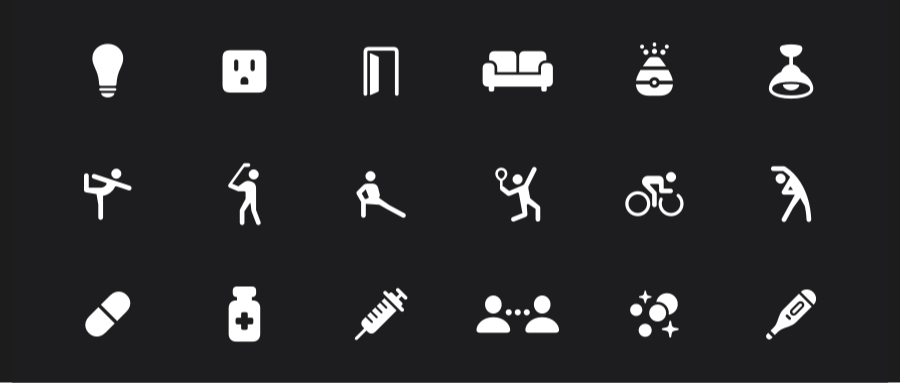

## 个人介绍

作者：Mim0sa，iOS 开发者，`iOS 摸鱼周报` 联合编辑，掘金主页：[Mim0sa](https://juejin.cn/user/1433418892590136)，云吸猫/狗爱好者。

## 审核介绍

审核：

## 不超过 120 个字的文章简介

本文基于 WWDC 2022 [Session 10157](https://developer.apple.com/videos/play/wwdc2022/10157/) 和 [Session 10158](https://developer.apple.com/videos/play/wwdc2022/10158/) 梳理。本文从 SF Symbols 4 的新特性切入，讨论 SF Symbols 这款由系统字体支持的符号库有哪些优点以及该如何使用。在这次 WWDC 2022 中，除了符号的数量的增加到了 4000+ 之外，还有自动渲染模式、可变符号等新特性推出，让 SF Symbols 这把利器变得又更加趁手和锋利了。

## 小专栏图文头图

## 公众号图文头图

