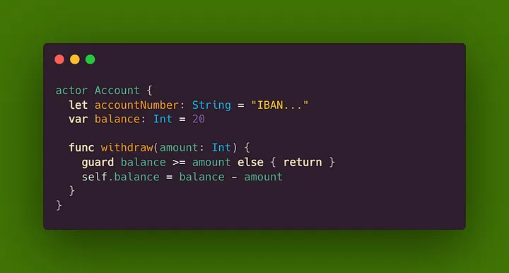

# [译] Swift | 深入理解 Actors

> 要学习原理，不要死记硬背

我是一个喜欢理解某个概念内部是如何运作的人，如果我不掌握其潜在的机制，关于一个概念的一切都会显得不清楚，感觉像是死记硬背而不是真正的理解。因此，我深入研究了几个关键的 Swift 概念：actors、async/await、structured concurrency 和 AsyncSequence。为了使这些概念更容易理解，我将使用实际现实生活中的例子来解释每个概念。**现在让我们来谈谈 Actors**。



> 译者注：本文是翻译，原文链接：[Swift Actors — in depth]()

## Actor 用来解决什么？

在 Swift 中，actor 是 Swift 5.5 中引入的一种引用类型，作为其高级并发模型的一部分。它的主要作用是在并发编程环境中防止数据竞争、以及确保安全访问共享可变状态或数据。为了更好地理解这一点，让我们举一个简单的例子：这是一台办公室里的打印机。


想象一下，你在一间拥有一个共享打印机的办公室，所有员工都可以使用该打印机。有一天，你需要打印一份文档，因此你将文件发送到打印机并前往取回。但当你到达打印机时，你会发现一个惊喜：打印出来的页面并不是你文件中的页面。你很困惑，再次检查并确认你发送了正确的文件。其他人可能无意或故意取消了你的打印作业并开始了他们自己的打印作业。面对这种混乱，你将采取哪些步骤来解决问题？


想象这样的情况：你打印了一份文档，你以为它们是正确的，在没有验证的情况下将它们直接交给了你的领导，如果打印的页面不符合预期，这可能会导致你被炒鱿鱼🦑。在编程中，当你在处理共享资源时，也会出现类似的困境。在 Swift 的环境下，这与作为引用类型的 class 尤其相关，在引用类型的特性下，对某个类实例所做的任何修改都将反映在应用程序中所有使用该类的实例中。这类似于一个人在共享打印机上的行为会影响每个人的打印作业。接下来，我们看一个具体的代码示例：

```swift
class Account {
	var balance: Int = 20 // 当前用户的存款是 20
	...
	func withdraw(amount: Int) {
		guard balance >= amount else { return }
		self.balance = balance - amount
	}
}

var myAccount = Account()
myAccount.withdraw(20)
```

我们的代码做了一个简单的操作：从帐户中提取资金。在这段代码中，我们会先检查账户余额是否足够，然后再进行提款。这种情况类似于在办公室使用打印机，当办公室中只有你一个人时，使用打印机（类似于帐户对象进行操作）不会造成任何问题，就像单独管理一个账户一样。然而，当多人（在编程中，多个线程）尝试同时使用打印机时，就会出现问题。

现在，回到多线程环境下的 `Account` 示例，例如在具有多个 CPU 内核的现代移动设备上。想象一下，两个线程试图同时在同一个账户对象上执行 `withdraw(20)` 函数。操作系统处理这些线程，分配 CPU 内核并管理它们的执行，但我们无法预测操作的确切顺序。

关键就在这里：假设第一个线程检查了余额，发现余额足够（余额>=金额）。但在扣除金额之前，发生了上下文切换，第二个线程开始执行。第二个线程也发现余额足够，因为第一个线程尚未完成取款。因此，它继续取款，余额为零。然后，当第一个线程恢复运行时，它继续执行原来的操作，即取款，尽管余额已被第二个线程耗尽。

这种情况类似于两个人试图使用同一台打印机。如果他们没协调好，最终可能会发送相互干扰的打印命令，导致打印输出混淆或丢失。在我们的账户示例中，这种缺乏协调的情况会导致账户透支，因为账户中的相同金额被扣除了两次，这也是我们要阐释的编程中所谓「并发访问所面临的挑战」。

实际上，在我们前面的例子中，其中一个取款操作本应因资金不足而被拒绝，但由于同时访问，两个取款操作都成功了，这种情况就是**「Race Condition」**（竞争条件）。**当多个线程同时访问和修改共享资源**（在本例中为账户余额），就会出现 Race Condition，而这些操作的最终结果取决于每个线程的执行时机。

**在 Race Condition 下，最终的输出结果是不可预测的，**因为它取决于那些程序无法控制事件的顺序和执行时间。我们的帐户示例中出现问题是因为两个线程都检查了余额，并发现在扣除金额之前的余额是足够的。这导致两个线程都继续提款，导致账户余额不正确。

像这样的竞争条件是编程中的一个严重的问题，特别是在对数据一致性和准确性有很高要求的系统中。他们强调需要在多线程环境中仔细管理共享资源，以确保以安全且可预测的方式执行操作。

## 使用 Actor

Swift 中的 Actor 为我们之前讨论的并发问题提供了一个优雅的解决方案。在引入 Actor 之前，管理并发访问的常见做法包括使用 **DispatchQueue**、**Operations **和 **Locks**。这些方法**虽然有效，但需要大量的人为代码干预和管理**。

现在随着 Swift 中 Actor 类型的引入，管理并发性所涉及的大部分复杂内容都被抽象化了。回想一下我们的打印机示例：我们如何才能确保没有人可以覆盖他人正在进行的打印作业？比较理想的解决方案是建立一个队列，将打印作业排队并**一次处理一个**。当每个新作业到达时，它都会加入队列并等待，打印机会按顺序处理每个作业。

这正是 Actor 的工作方式。**Actors 有一个内部邮箱系统，其功能就类似于队列**。发送给 actor 的请求被放置在这个邮箱中，并且它们以**串行方式**被一个接一个地处理。这种排队机制确保操作按顺序执行，从而防止 race Condition 的发生。此外，由于内部队列以及邮箱机制是由 actor 自己管理的，因此那些复杂的底层机制对程序员来说都是隐藏的。这使得在 Swift 中处理并发任务变得更加简化和防错。

太棒了哈？😂


但这在实践中是如何运作的呢？Actors 确保了我们所说的「**数据隔离**」。

要理解数据隔离，让我们用办公室打印机来类比。想象一下将这台打印机封装在一个单独的房间中并断开其与 Wi-Fi 的连接。现在，如果有人想打印一些东西，他们必须亲自去这个房间等待轮到他们。此设置可有效防止打印机的任何重叠或并发使用，确保一次只有一个人可以使用它。

在 Swift 环境中，actors 的工作方式类似。**当你将数据封装在一个 actor 中时，你实际上是将其与其他代码的直接访问隔离开来了**。任何想要与数据交互的代码都必须通过 actor，切实地“排队”并等待轮到它。这意味着即使在并发环境中，参与者也会序列化对其数据的访问，确保在任何给定时间只有一段代码与之进行交互。

现在让我们看一些代码，看看这个概念如何在实践中应用......

在修改后的 `Account` 示例中，从 class 到 actor 的转变非常简单。通过简单地更改我们的定义中的 `class` 为 `actor`，我们就使 `Account` 对象成为线程安全的了。这样的更改虽然在语法上很少，但对这个对象在并发环境中的访问和操作具有重大影响。

```swift
actor Account {
	var balance: Int = 20 // 当前用户的存款是 20
	...
	func withdraw(amount: Int) {
		guard balance >= amount else { return }
		self.balance = balance - amount
	}
}
```

把 class 转换成 actor 就是这么简单，但其中也并非没有挑战。如果在将 class 转换为 actor 后尝试编译代码，可能会遇到一些错误。这是由于 actor 的性质及其数据隔离属性造成的，就像我们把打印机放在一个单独的房间并断开 Wi-Fi 连接一样。

当我们将 class 转换为 actor 时，不再可以像以前那样，从其上下文外部直接访问其属性和方法。 Actor 执行严格的访问控制以确保线程安全。因此代码中关于 `Account` 对象的所有访问点现在都需要更新了。这通常涉及使用异步模式（例如 `async` 和 `await`）与 actor 交互，确保对其方法和属性的访问被正确地序列化了，并且不会出现并发访问的问题。

```swift
var myAccount = Account()
myAccount.withdraw(20)  // 这行代码现在是错误的了 ❌
await myAccount.withdraw(20) // 这样是对的 ✅
```

## 理解「跨 Actor 引用」

> 译者注：**A reference to an actor-isolated declaration from outside that actor** is called a cross-actor reference.

在 Swift 中，当我们说 Actor 保证数据隔离时，我们的意思是 Actor 内的所有 mutable 属性和函数都与外部的直接访问隔离。这种隔离是 Actor 的核心特性，对于确保并发编程中的线程安全至关重要。但这种隔离对于访问和修改这些属性和函数又意味着什么呢？

本质上，如果你想读取一个属性、更改一个值或调用一个 actor 的函数，你无法像使用 class 或 struct 时那样去直接执行你想要的操作，在 actor 中你只能在那等着，等到轮到你才可以进行操作。其具体做法是通过向 actor 的邮箱系统发送请求，然后你的请求将被排队并依次得到处理。只有当轮到你的请求被处理时，你才能读取或修改 actor 的属性或调用其函数。

此过程称为 **Cross-actor reference**。当你从 Actor 外部引用或访问该 Actor 内的某些内容时，你就进行了「跨 Actor 引用」，在实际代码中，指使用异步模式（例如 `async` 和 `await` ）与 actor 交互。当你使用这样的代码时，其实际上表示：“我需要访问或修改此参与者中的某些内容，这是我的请求，我将异步等待，直到安全且适合继续为止。“

> Cross-actor reference 是指从 actor 范围之外与该 actor 的内部状态（例如可变属性或函数）的任何访问或交互。这种交互可能来自另一个的 actor 或来自非 actor 的代码。

简而言之，actor 中的数据隔离意味着外部世界与 actor 内部状态的任何交互都必须通过这个受控的异步过程进行协调，以确保 actor 可以安全地管理其状态，而不会出现并发访问冲突的风险。

```swift
actor Account {
	var balance: Int = 20 // 当前用户的存款是 20
	// ...
	func withdraw(amount: Int) {
		guard balance >= amount else {return}
		self.balance = balance - amount
	}
}

actor TransactionManager {
	let account: Account

	init(account: Account) {
		self.account = account
	}

	func performWithdrawal(amount: Int) async {
		await account.withdraw(amount: amount)
	}
}

// 账户提款
let account = Account()
let manager = TransactionManager(account: account)

// 使用 TransactionManager 执行提款操作
Task {
	await manager.performWithdrawal(amount: 10) // cross-actor reference
}

// 在另一个 Actor 执行提款操作
Task {
	await myAccount.withdraw(amount: 5) // cross-actor reference
}
```

在 Swift 的并发模型中，`await` 关键字是一个至关重要的组成部分，特别是在与 actor 一起使用的时候。有趣的是，你可能已经注意到，我们不需要在 actor 中显式标记 `withdraw` 方法为 `async`。这是因为默认情况下，由于 Actor 本身的性质的原因，Actor 中的任何函数都被视为潜在的异步函数，从外部与参与者的所有交互本质上都是异步的，这也意味着任何跨 Actor 引用都需要 `await` 以开头。

使用 `await` 就像发出一个潜在暂停的信号，类似于你在其他人使用办公室打印机时等待轮到你。它向 Swift 运行时表明代码中的这一点可能需要暂停执行，直到参与者准备好处理请求。这种暂停并不总是会发生的————如果参与者不忙于其他任务，你的代码将立即继续。这就是为什么我们将其称为**“可能的”暂停点**。

现在，将其应用到我们的 `withdraw` 场景中，我们的操作变得更加安全和可预测。想象一下两个线程试图在同一个 `Account` 上同时执行 `withdraw`，在有 actor 和 `await` 参与的情况下，即使操作系统在执行过程中从第一个线程切换到第二个线程，第二个线程也不会立即进入其 `withdraw` 函数。它的执行将在该 `await` 点暂停，等待第一个操作完成。这确保了操作被序列化————第一个线程将完成他的提款操作，然后 actor 才处理第二个线程的请求。此时，第二个线程会发现余额不足以再次取款，函数将返回，而不对余额进行任何进一步的更改。

通过这种相互配合，actor 模型、异步访问模式和 `await` 关键字可以确保 `Account` 能安全地对共享资源进行处理，防止竞争条件并维护数据完整性。

## Serial Executor

> 译者注：A service that executes jobs.

在我们关于 Actor 的讨论中，我们提到每个 Actor 都有一个内部串行队列，它负责一一处理 Actor 邮箱中的任务（或者说“邮件”）。 Actor 的这个内部队列称为 **Serial Executor**，在某种程度上类似于 **Serial DispatchQueue**。然而这两者其实之间存在重大差异，特别体现在它们如何处理任务执行顺序及其底层实现上。

其中一个显着的区别是：**等待 Actor 的串行执行器的任务不一定按照等待的顺序执行**。这与 Serial DispatchQueue 的行为不同，后者遵循严格的先进先出 (FIFO) 策略，如果使用 Serial DispatchQueue，任务将完全按照接收的顺序执行。

另一方面，与 Dispatch 相比，Swift 的 Actor 运行时采用了更轻量、更优化的队列机制，专为利用 Swift 异步函数的功能而定制。这种差异源于执行器与 DispatchQueue 的本质，执行器本质上是一个管理任务提交和执行的服务，与 DispatchQueue 不同，执行器不必严格按照作业提交的顺序执行。相反，**执行器被设计成根据各种因素（包括任务优先级）来确定任务的优先级，而不仅仅是根据提交顺序**。

Serial Executors 和 Serial DispatchQueues 之间的任务调度和执行之间的细微差别支撑了 Swift Actor 模型的灵活性和效率。执行器提供了一种更动态的方式来管理任务，特别是在并发编程环境中。我计划在单独的讨论中更深入地探讨 Executor，以进一步阐明它们在 Swift 并发模型中的作用和优势。

## 与 Actor 交互的规则

1. 访问 actor 中的只读属性不需要 `await`，因为它们的值是不可变的。

```swift
actor Account {
	let accountNumber: String = "IBAN---" // 注意这个变量是不可变的 ⚠️
	var balance: Int = 20
	// ...
	func withdraw(amount: Int) {
		guard balance >= amount else {return}
		self.balance = balance - amount
	}
}

let accountNumber = account.accountNumber // 这是正确的 ✅
Task {
	let balance = await account.balance // 这是正确的 ✅
	let balance = account.balance // 这是错误的 ❌
}
```

2. 禁止利用 Cross-actor reference 修改可变变量，即使使用 `await` 也是如此。

```swift
account.balance = 12 // 这是错误的 ❌

await account.balance = 12 // 这也是错误的 ❌
```

> 理由：支持 cross-actor 属性集虽然是可能的，但是，我们不能合理地支持 cross-actor 输入输出操作，因为在 get 和 set 之间会有一个隐含的暂停点，这实际上会引发竞争条件。此外，异步设置属性的值可能更容易无意中破坏某个应当不变的属性，例如一种情况：某个不变的属性是由另两个属性同时更新来维持的。

3. 所有与 actor 隔离的函数都必须使用 `await` 关键字调用。

## 非隔离成员

在 Swift 的并发模型中，actor 中的非隔离成员起着至关重要的作用。非隔离成员允许访问 actor 的某些部分，且无需异步调用或在 actor 的任务队列中等待轮到他们。这对于不修改 actor 状态的属性或方法特别有用，也因此不会导致竞争条件或其他并发问题。

```swift
actor Account {
	let accountNumber: String = "IBAN..." // 一个常量、非隔离的属性
	var balance: Int = 20
	
    // 一个非隔离的方法
	nonisolated func getMaskedAccountNumber() -> String {
		return String.init(repeating: "*", count: 12) + accountNumber.suffix(4)
	}
    
	func withdraw(amount: Int) {
		guard balance >= amount else { return }
		self.balance = balance - amount
	}
}

let accountNumber = account.getAccountNumber() // 无需使用 await ⚠️
```

在你的示例中，`accountNumber` 是 actor 中的常量属性并且是不可变的。这种不变性使其成为线程安全的，并且消除了隔离的需要。因此，尽管是 actor 的一部分，但 `accountNumber` 无需 `await` 关键字即可同步访问。相反，`balance` 是一个可变属性，需要在 actor 内部进行隔离。与 `balance` 的任何交互（如在 `withdraw` 函数中）都必须遵守行为体的隔离协议，因此通常需要异步访问。

Actor 中隔离成员和非隔离成员之间的区别至关重要。在不需要严格隔离的情况下，它有助于优化性能和简化代码，同时还能维护 actor 模型固有的安全性和并发性管理。

## 总结

在我们对 Swift Actors 世界的全面探索中，我们发现了 Swift 并发模型中这一强大功能的深度和复杂性。作为 Swift 5.5 的基本组成部分，Actor 重新定义了我们处理共享可变状态和并发问题的方式，提供了一种更强大、更安全的方法来处理并发编程挑战。

我们已经了解了 Actor 如何充当针对常见并发问题（如竞争条件、死锁和活锁）的防护措施，与 DispatchQueue、Operations 和 Locks 等传统方法相比，提供了更精简、更高效的方法。 Actor 的引入代表了简化并发管理的重大飞跃，使其对于开发人员来说更易于访问且不易出错。

展望未来，在未来的讨论中深入探讨 Executors 的承诺为 Swift 并发模型中更高级的主题打开了大门。这种探索不仅仅是理解编程功能，而是拥抱新的范例来编写更安全、更可靠、更高效的 Swift 代码。

总之，Swift Actors 不仅仅是 Swift 开发人员工具箱中的一个新工具，它还代表了我们思考和处理并发的方式的根本转变，使我们的代码更安全、更可预测、更容易推理。对 Swift Actors 的探索证明了 Swift 作为一种不断适应和改进以满足现代软件开发需求的语言的不断发展。

> 译者注：读的时候很有感觉，但是翻译完发现废话很多😅


