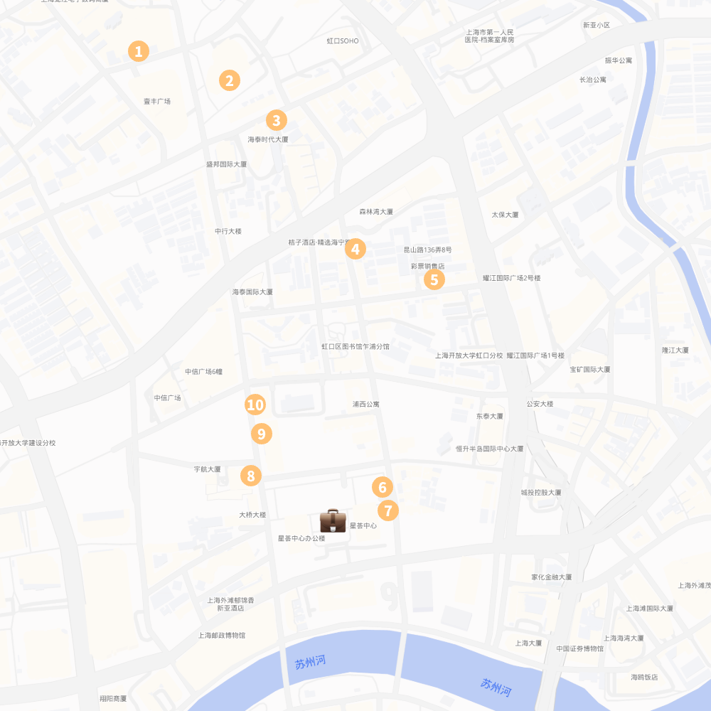

这是一篇在 上海星荟中心 附近，工作日午餐的吃面心得，罗列了 10 家我觉得还不错的店铺。

由于我常吃+爱吃偏本帮口味的**拌面**，所以本文的点单和点评肯定带有强烈的个人色彩，不完全代表餐馆的所有菜品水平。

## 1. 三林塘馄饨

店如其名，因创始人来自浦东三林地区而得名，店里的主要卖馄饨、面，但也卖饭，是一家经营四十余年的社区老店。店里的招牌之一是辣肉馄饨，就是干挑的馄饨配上辣肉面的辣肉（肉糜），我觉得辣肉不好吃，但是馄饨还是不错的，个大，皮有韧劲。

在面方面，我吃的比较多的是现炒的雪菜肉丝拌面，是绿色的雪里蕻炒的，好吃；除了常规爆炒内脏、烤麸、素浇、大肠、大排等的浇头，他家也有一些奇怪的浇头，比如宫保鸡丁、鱼香肉丝🤔。他们家的油面筋塞肉味道也很好吃，和传统的不一样，肉不是碎碎的而是结实的，面筋部分也是非常大块的面筋，不是那种从小吃的黄色的薄薄的面筋。另外他家有小馄饨+面的组合，还挺有意思。

他家面条的出品有的时候煮的黏糊糊的，有的时候又比较干爽，然后偶尔馄饨里能吃到小小的骨头。但是这个价格的话，我感觉已经算挺好的了。

## 2. 大龙汤包

这家店是扬州汤包店，店里有小笼（汤包），蒸饺，包子，面，粉丝汤，馄饨，偏甜口的，也是一家大众点评必吃榜店铺。这家店的招牌我想应该是蒸饺和汤包，老板说是现点现包，中午一般点这两种然后再点一份粉丝汤或者油豆腐汤（没有粉丝）也就够了，我也点过很多次拌面，他们的葱油拌面和浇头是分开上的，好评。

我推荐他们家的蒸饺和汤包。在汤包方面，我只吃过鲜肉的（其实也吃过蟹粉的但是已经想不起来味道了），我认为小笼就要吃鲜肉的，其他的不好吃。在蒸饺方面，我觉得除了鲜肉的其他都值得尝一尝，鲜肉的蒸饺几乎就是大号的汤包，很甜，比较一般。其他几款蒸饺我个人觉得都好吃，但是要注意的是有几款蒸饺中的肉很松散（比如三丁蒸饺），感觉像肉松一样，所以蒸饺的内馅主角绝对不是肉，有的人是不喜欢这种口感，要注意了。另外要提醒的是鸳鸯蒸饺是蒸饺里面馅料左侧是汤包里面的肉馅，右侧是菜包子里面的菜馅，两侧馅料不是融合的，是分开的，像小当家里面的黄金比例烧卖一样，很神奇，但是两种馅料都偏甜，有的人是不喜欢的。

一份蒸饺和小笼的量不算小，如果胃口比较小，记得只点半份。怕甜味腻的要多配醋。

## 3. 奥灶面

## 4. 飘香拉面

飘香拉面是一家典型的上海河南拉面，所谓上海河南拉面

## 5. 玛格萝妮比萨屋

这个店号称是上海小囡的西餐启蒙，但我以前完全没吃过，我的西餐启蒙是豪享来🐮。现在已经发展成连锁店铺了，昆山路这家店是最老的一家店。店里装修很有情调，价格也不算贵。

这家店有披萨、饭、沙拉、甜品、意面等，你问面在哪里，意面当然也算拌面🍜。

## 6. 福和面馆

## 7. 超级碗

作为尊贵的超级碗金饭碗用户，我可以告诉你，超级碗是有面的。

## 8. 牛排面馆

这里的牛排不是西餐牛排，指的是泉州牛排，但是说实话和泉州当地的牛排配咸饭也不太一样，这家店里除了面，还有粉和饭，据我观察，反而是点米粉的人多过点面的人。

## 9. 荔银肠粉

## 10. 绿柠食堂

