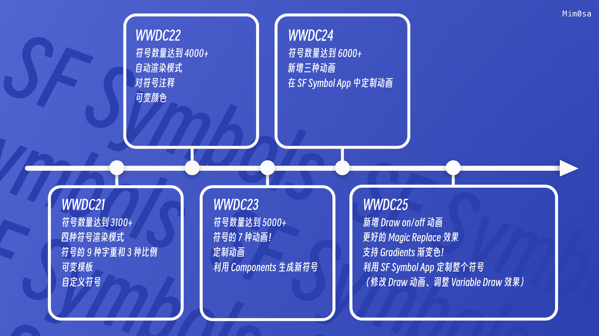

本文基于 WWDC25 [Session 337](https://developer.apple.com/videos/play/wwdc2025/337/) 和之前的相关 Session 梳理。

<!--more-->

> 由于今年没有内参了，今年不是内参供稿。本文将主要介绍 SF Symbols 7 的新特性、Symbols 的常见使用方式和一些实用的特性，往年部分内容将不再提及，且文风会更加放飞自我。这里是往年的内参：
>
> * [WWDC 2021 内参：SF Symbols 3 使用指南](https://mim0sa.github.io/2022/10/07/SF-Symbols-3-%E4%BD%BF%E7%94%A8%E6%8C%87%E5%8D%97.html)
>
> * [WWDC 2021 内参：定制属于你的 Symbols](https://mim0sa.github.io/2022/10/08/%E5%AE%9A%E5%88%B6%E5%B1%9E%E4%BA%8E%E4%BD%A0%E7%9A%84-Symbols.html)
>
> * [WWDC 2022 内参：SF Symbols 4 使用指南](https://mim0sa.github.io/2022/10/09/SF-Symbols-4-%E4%BD%BF%E7%94%A8%E6%8C%87%E5%8D%97.html)
>
> * [WWDC 2023 内参：SF Symbols 5 使用指南](https://mim0sa.github.io/2024/05/20/SF-Symbols-5-%E4%BD%BF%E7%94%A8%E6%8C%87%E5%8D%97.html)
>
> * [WWDC 2024 内参：SF Symbols 6 使用指南](https://mim0sa.github.io/2024/07/08/SF-Symbols-6-%E4%BD%BF%E7%94%A8%E6%8C%87%E5%8D%97.html)

