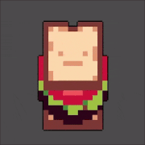
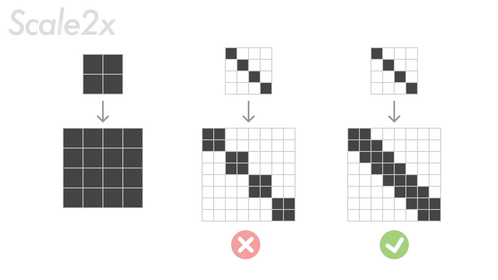
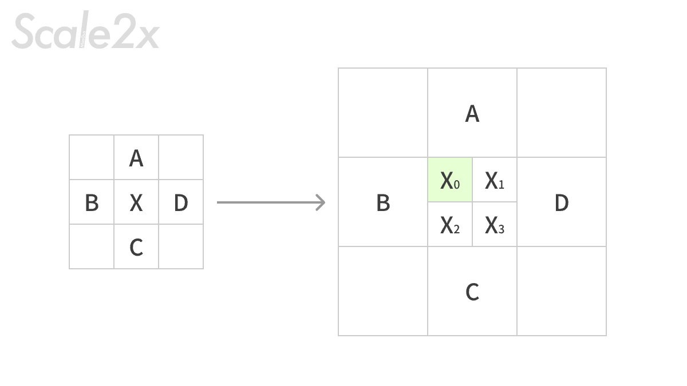
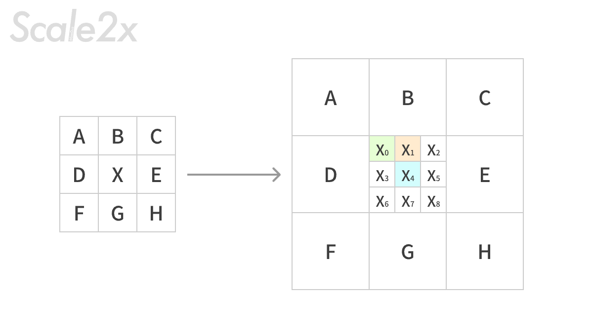
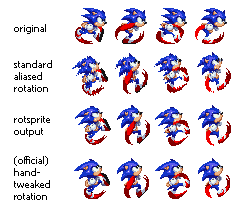
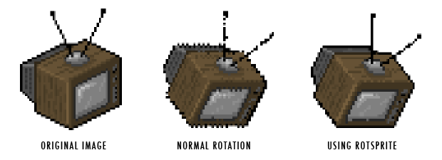
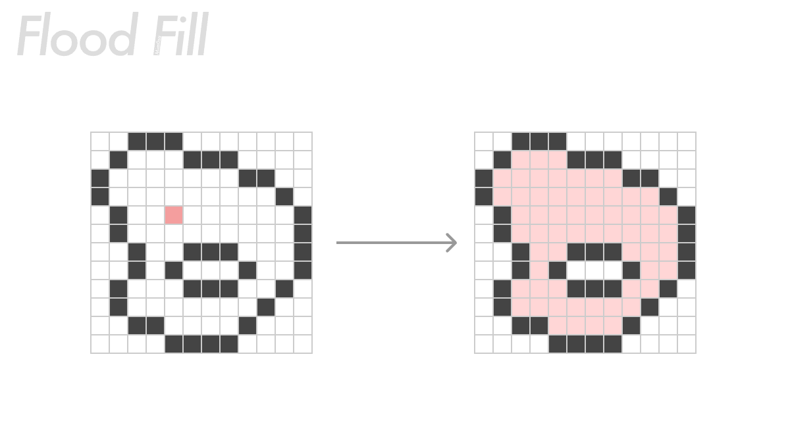
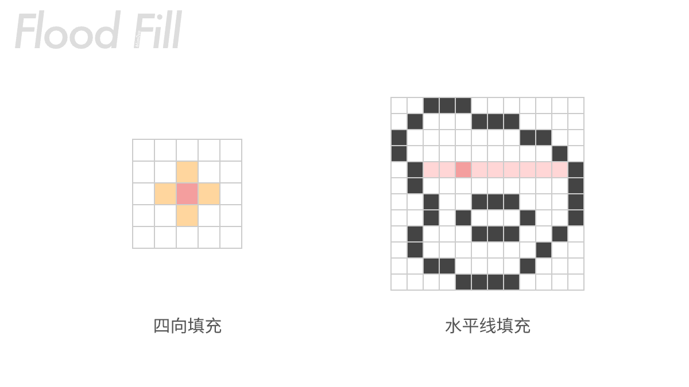
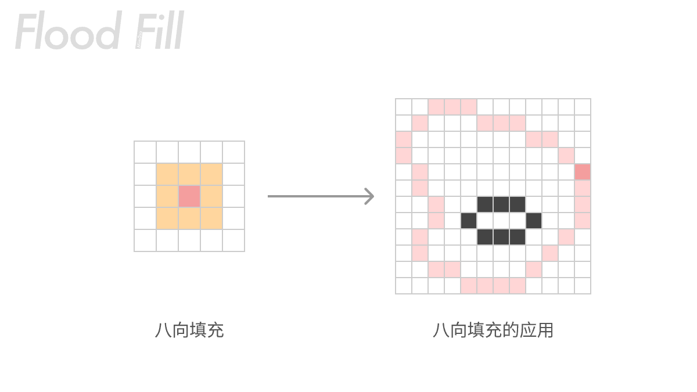
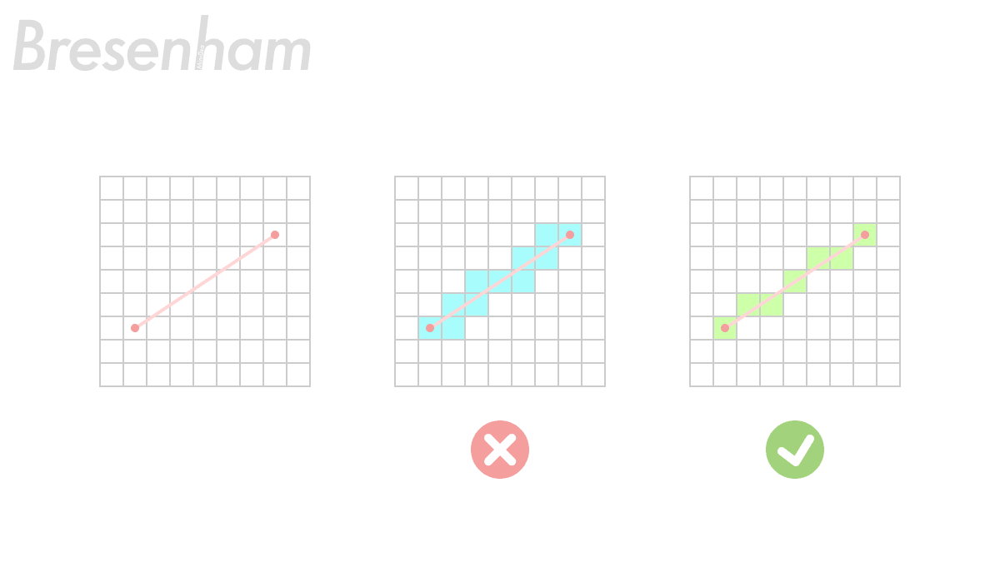

在网络冲浪的时候发现了一个很有趣的伪 3D 实现效果，叫做 Sprite Stacking，感觉非常神奇，研究了原理之后发现实际上实现起来还挺简单的：



## 🥞 什么是 Sprite Stacking

Sprite Stacking 实际上就是将很多图片素材重叠在一起，并给每一张素材都添加一个 Y 轴上的偏移，让堆叠起来的素材看起来有一个带角度俯视角的立体效果，再配合每层素材的独立旋转，就可以产生伪 3D 的效果。


这种技术常被用于游戏开发，可以将以多边体为最小元素组成的 3D 模型一层层“切”开，使其变成一组图片素材，达到规避在引擎中使用 3D 模型的目的。也有的游戏，整个场景都用模型搭建，但是导出的时候切成一层一层，实现整个游戏场景都是伪 3D 的。


这样的素材除了从 3D 模型切片生成之外，当然也可以手动生成。对于最常见的方形像素风格的模型切片来说，实际上就是一组像素画，那么我们通过直接画一组像素画也可以模拟相应的效果。

手绘多层像素画的方式虽然从效率的角度来说，没有从 3D 模型切片来的高效，但是胜在操作难度小，用来做快速实验或者做简单的 gif 之类的还是挺好的。搜索了一下在手机上没有这样的软件，所以我动手写了一个。

<video src="./resources/demo.MOV"></video>

## 🦾 用到了什么

在实现的过程中，学到了一些🧀，在这里记录一下：

### Scale2x

在制作像素画的时候，常常有让画面的精细度翻倍的需求；但是让像素画的纬度翻倍不是简单的让一个像素变成4个像素，而是需要在翻倍之后像素画的线条仍然流畅的连接着以及不要出现大规模的棱角。这里需要用到 Scale2x 或 ScaleNx 算法。



Scale2x 的通过将原来的每个像素块都拆分成新的四个像素，这四个像素块会根据上下左右像素颜色来决定是否要被周围的颜色“感染”，它的主要判断逻辑，依照下图的字母来说，是这样的：对于 X(0) 来说，如果 A 和 B 的颜色相同，且与 C 和 D 的颜色不一样的话，那么X(0) 将被感染成 A 和 B 的颜色，不然就维持 X 本身的颜色；其他四个角也同样按照这个逻辑执行；如果遇到边界，则是用自身颜色。他的计算是这样的：

```c
X0 = A == B && B != D && A != C ? B : X
```



Scale4x 也可以做到，就是执行两次 Scale2x，也就是 2 的倍数的 ScaleNx 都可以用 2x 来实现。除了 2x，还有一种 3x 效果也不错，它的主要判断逻辑，依照下图的字母来说，是这样的：对于 X(0) 来说，逻辑和 2x 是一样的，它的值会从 X 和 B/D 中决出；对于 X(4) 来说，取 X 本身；对于 X(1) 这种处于边缘中间未知的颜色来说，会稍微复杂一点，这里简单概括一下，就是 X(1) 想要被 B 感染的话，除了类似 X(0) 的条件之外，还需要多一条 X 不和相邻斜对角（A/C）的颜色相同。他的计算是这样的：

```c
X1 = (D == B && B != E && D != G && X != C) || (B == E && B != D && E != G && X != A) ? B : X
```



实现代码如下：

```swift
func scale2x(_ src: [[Pixel]]) -> [[Pixel]] {
    let h = src.count
    let w = src.first?.count ?? 0
    let dstW = w * 2
    let dstH = h * 2
    var dst = Array(repeating: Array(repeating: src[0][0], count: dstW), count: dstH)
    for y in 0..<h {
        for x in 0..<w {
            let E = src[y][x]
            let B = y > 0       ? src[y-1][x] : E
            let H = y < h-1     ? src[y+1][x] : E
            let D = x > 0       ? src[y][x-1] : E
            let F = x < w-1     ? src[y][x+1] : E
            let e0: Pixel = (B != H && D != F && D == B) ? D : E
            let e1: Pixel = (B != H && D != F && B == F) ? F : E
            let e2: Pixel = (B != H && D != F && D == H) ? D : E
            let e3: Pixel = (B != H && D != F && H == F) ? F : E
            dst[y*2][x*2]     = e0
            dst[y*2][x*2+1]   = e1
            dst[y*2+1][x*2]   = e2
            dst[y*2+1][x*2+1] = e3
        }
    }
    return dst
}

func scale3x(_ src: [[Pixel]]) -> [[Pixel]] {
    let h = src.count
    let w = src.first?.count ?? 0
    let dstH = h * 3
    let dstW = w * 3
    var dst = Array(
        repeating: Array(repeating: src[0][0], count: dstW),
        count: dstH
    )
    
    for y in 0..<h {
        for x in 0..<w {
            let E = src[y][x]
            let A = y > 0 && x > 0        ? src[y-1][x-1] : E
            let B = y > 0                 ? src[y-1][x]   : E
            let C = y > 0 && x < w-1     ? src[y-1][x+1] : E
            let D = x > 0                 ? src[y][x-1]   : E
            let F = x < w-1              ? src[y][x+1]   : E
            let G = y < h-1 && x > 0     ? src[y+1][x-1] : E
            let H = y < h-1              ? src[y+1][x]   : E
            let I = y < h-1 && x < w-1   ? src[y+1][x+1] : E
            
            var e = Array(repeating: Array(repeating: E, count: 3), count: 3)
            
            if B != H || D != F || A != I || C != G {
                if D == B { e[0][0] = D }
                if (B == F && E != C) { e[0][1] = B }
                if B == F { e[0][2] = F }
                if D == H { e[1][0] = D }
                if F == H { e[1][2] = F }
                if D == H { e[2][0] = D }
                if (H == F && E != G) { e[2][1] = H }
                if H == F { e[2][2] = F }
            }
            
            for dy in 0..<3 {
                for dx in 0..<3 {
                    dst[y*3 + dy][x*3 + dx] = e[dy][dx]
                }
            }
        }
    }
    return dst
}
```


### RotSprite 旋转算法

[RotSprite](https://info.sonicretro.org/RotSprite) 旋转算法是一种专门用来旋转像素画的算法，他最开始是用来旋转「音速索尼克」的。由于当时传统的旋转算法可能会导致模糊、生成新的颜色、以及会导致像素画内轮廓线条断掉等问题，Xenowhirl 写了这个算法用来生成 45 度旋转之后的索尼克。这样生成出来的像素画更能表现出硬朗的线条和造型。



这个旋转算法挺简单的，但大家实现的也都不太一样，我在 app 里面实现的是较为简单的实现方法：先将图片 Scale8x，然后将图片旋转 x 度，然后再缩小 8 倍。比较细节的地方有，比如在 scale 算法执行的时候，可以不严格判断两个颜色是否相同，而是对相近颜色判断成一样；还有 scale 完之后的微调等。但我的 App 中，颜色较为固定、画布大小也不大，所以这些细节对我来说影响不大，所以就没有实现。



### Flood Fill 泛洪填充

泛洪填充实际上就是在电脑上画画的时候用到的「颜料桶」工具。



他的算法比较简单，就是判断周围的颜色，如果符合条件就向周围扩散，这是四向扩散的算法（下图左）：

```swift
func floodFill(canvas: [[Pixel]], row: Int, col: Int, newColor: Pixel) -> [CanvasPosition] {
    guard col >= 0, row >= 0, col < canvas.count, row < canvas[0].count else {
        return ([])
    }
    let targetColor = canvas[col][row]
    if targetColor == newColor {
        return ([])
    }
    var newCanvas = canvas
    var modifiedPoints: [CanvasPosition] = []
    func recursiveFill(_ x: Int, _ y: Int) {
        guard x >= 0, y >= 0, x < newCanvas.count, y < newCanvas[0].count else {
            return
        }
        if newCanvas[x][y] != targetColor || newCanvas[x][y] == newColor {
            return
        }
        newCanvas[x][y] = newColor
        modifiedPoints.append(CanvasPosition(y, x))
        recursiveFill(x + 1, y)  // 右
        recursiveFill(x - 1, y)  // 左
        recursiveFill(x, y + 1)  // 下
        recursiveFill(x, y - 1)  // 上
    }
    recursiveFill(col, row)
    return modifiedPoints
}
```

但细心的你肯定会发现，这个算法将会导致一个巨大的递归，理论上来说很容易爆了，所以又衍生出水平线泛洪填充算法（下图右），它的逻辑就是在优先填充行，这样一行一行填充，就能减轻递归的压力；在某些特定的场景下，横向或者纵向优先的填充会有更好的性能。



除了四向扩散填充，还可以八向扩散填充，但这种填充主要用于另一种场景，就是填充线条。因为八向填充可以填充到斜对角相邻的颜色。



### Bresenham 直线算法

Bresenham 直线算法可以找到两点之间形成直线的所有像素块，他不会产生下图中间蓝色那种像素块相连的情况，而是会产生下图右侧绿色方块那样的「完美像素」效果。但在我的 App 中，画布实在太小了，所以当用户在画画的时候，我并不能把用户触摸产生的点有效的分离和省略，所以这个算法在我的 App 上应用的场景比较少，只有当用户快速划一条线的时候才能看到明显的效果。



## 🪤 还能做些什么

想了一下未来的更新方向：

* 更大的画布、层数；更好的性能
* 计算生成边缘轮廓
* 更自由的视角控制
* 渲染 3D 模型
* 导出 .obj 模型文件


