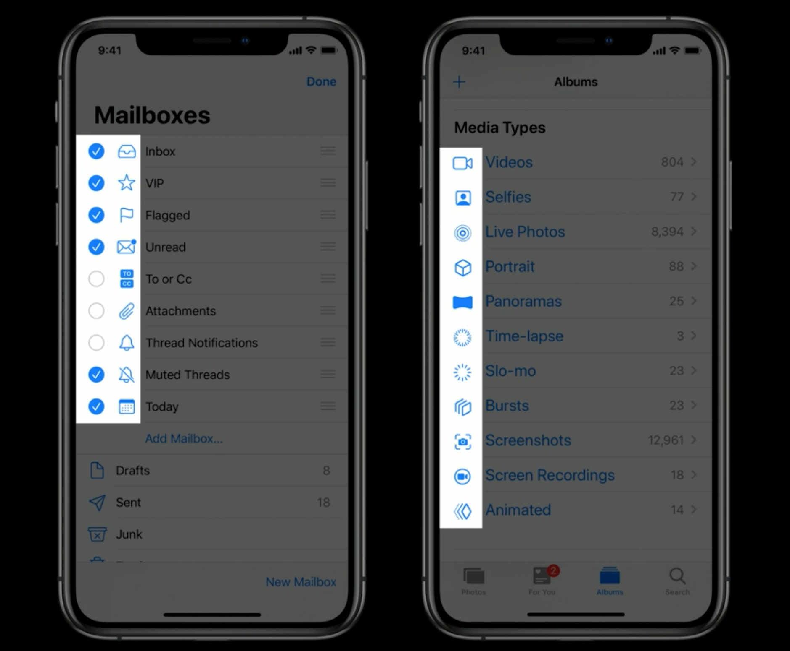
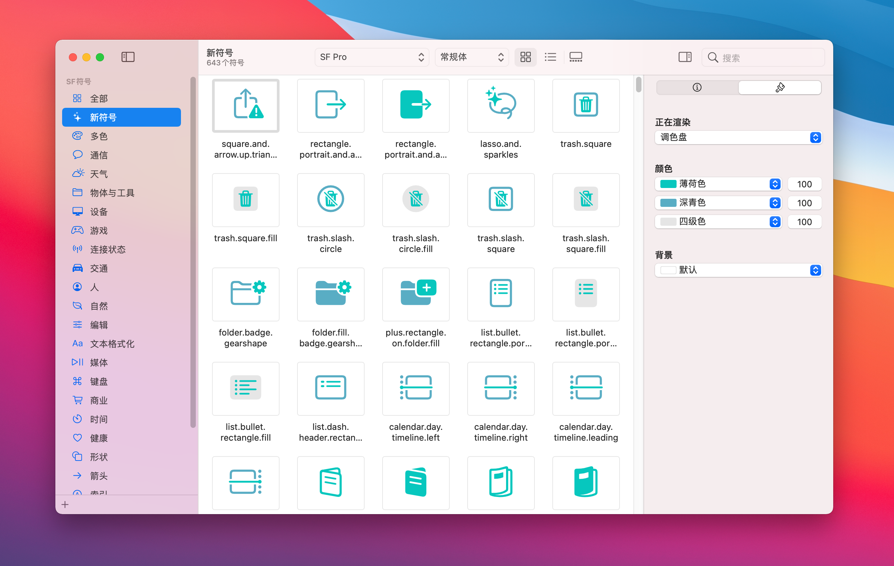
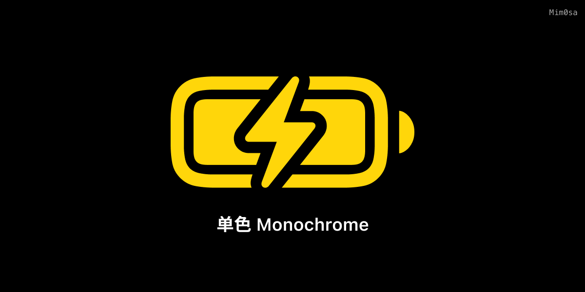
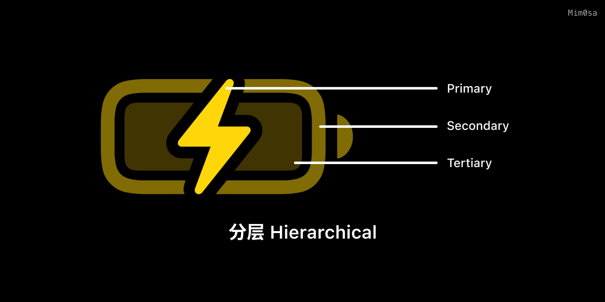
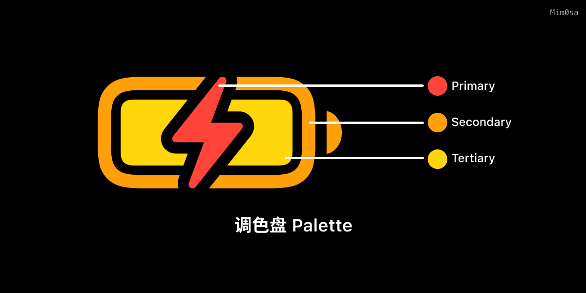
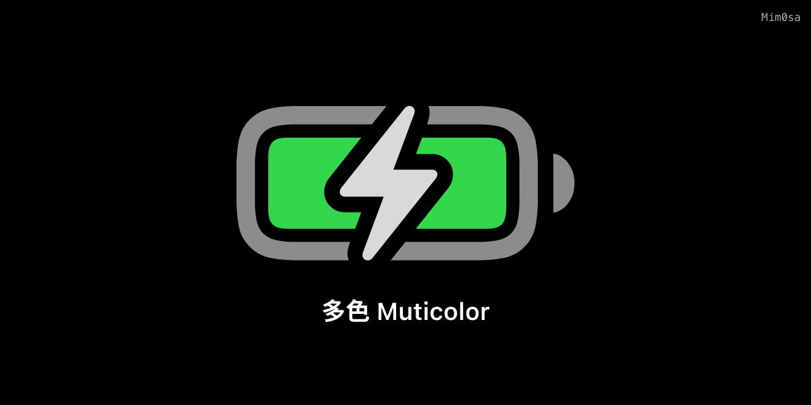
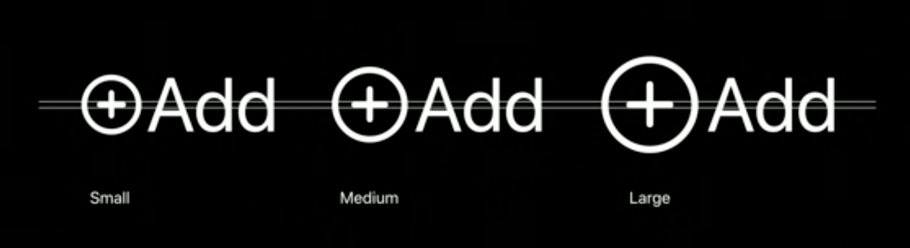

# SF Symbols 使用指南

> 作者：Mim0sa，iOS 开发者

本文基于 [Session 10097](https://developer.apple.com/videos/play/wwdc2021/10097), [Session 10251](https://developer.apple.com/videos/play/wwdc2021/10251) 和 [Session 10349](https://developer.apple.com/videos/play/wwdc2021/10349) 梳理。

## 什么是 SF Symbols

符号（图标）在界面中起着非常重要的作用，它们能有效地传达意义，它们可以表明你选择了哪些项目，它们可以用来从视觉上区分不同类型的内容，而且符号出现在整个视觉系统的各处，这使整个用户界面营造了一种熟悉的感觉。

符号的实现和使用方式多种多样，但设计和使用符号时有一个更古不变的问题，那就是将符号与用户界面的另一个基本元素----'“文本”很好地配合。符号和文字在用户界面中以各种不同的大小被使用，他们之间的排列形式、对齐方式、符号颜色、文本字重与符号粗细的协调、本地化配置以及无障碍设计都需要开发者和设计师来细心配置和协调。



为了方便开发者更便捷、轻松地使用符号，Apple 在 iOS 13 中开始引入他们自己设计的海量高质量符号，称之为 SF Symbols。SF Symbols 拥有超过 3100 个符号，是一个图标库，旨在与 Apple 平台的系统字体 San Francisco 无缝集成。符号有 9 种字重和 3 种比例，并自动与文本标签对齐。同时这些符号是矢量的，这意味着它们是可以被拉伸的，使得他们在无论用什么大小时都会呈现出很好的效果。它们也可以被导出并在矢量图形编辑工具中进行编辑，来创建具有共享设计特征和无障碍功能的自定义符号。


对于开发者来说，这套 SF Symbols 无论是在 UIKit，AppKit 还是 SwiftUI 中都能运作良好，且使用方式也很简单方便。本文将会使用 AppKit、UIKit 和 SwiftUI 的代码示例来带大家探索如何在自己的 App 中轻松加入 SF Symbols。 

## 如何使用 SF Symbols

在这部分，将通过介绍 SF Symbols 的一些独有的特性，来带大家深入了解 SF Symbols，展示如何在代码中使用他们，以及介绍一些使用时的注意事项。

### SF Symbols 3 App

在开始介绍如何使用 SF Symbols 之前，我们可以先下载 SF Symbols 3 App，这款 App 中收录了所有的 SF Symbols，并且记录了每个符号的名称，支持的渲染模式，不同语言的变体，不同 OS 版本下可能出现的不同的名称，并且可以实时预览不同渲染模式下不同强调色的不同效果。你可以在[这里](https://developer.apple.com/sf-symbols/)下载 SF Symbols 3 App。



### 渲染模式

通过之前的图片你可能已经注意到了，SF Symbols 可以拥有多种颜色，有一些 symbol 甚至还有预设的颜色，例如代表天气、肺部、电池的符号等等。如果要使用这些带有自定义颜色的符号，你需要了解，SF Symbols 有四种渲染模式：

#### 单色模式 Monochrome

在 iOS 15 / macOS 11 之前，单色模式是唯一的渲染模式。要设置单色模式的符号，我们只需要设置图片的 tint color 或者 accent color 就可以完成。

```swift
let image = UIImage(systemName: "battery.100.bolt")
imageView.image = image
imageView.tintColor = .systemYellow
```



#### 分层模式 Hierarchical

每个符号都是预先分层的，如下图所示，符号按顺序最多分成三个层级：primary，secondary，tertiary。有一些符号只有一个层级，也就是只有 primary 层。有一些符号只有两个层级，其中第一个层级一定是 primary 层，第二个层级可以是 secondary 层，也可以是 tertiary 层。**SF Symbols 的分层设定不仅在分层模式下有效，在后文别的渲染模式下也是有作用的。**

分层模式和单色模式一样，可以设置一个颜色。但是分层模式会以该颜色为基础，生成降低主颜色的不透明度而衍生出来的其他颜色（如图中的电池符号看起来是由三种黄色组合而成）。在这个模式中，层级结构很重要，如果缺少一个层级，相关的派生颜色将不会被使用。

```swift
var image = NSImage(systemSymbolName: "battery.100.bolt",
                    accessibilityDescription: "Battery")
let config = NSImage.SymbolConfiguration(hierarchicalColor: .systemYellow)
imageView.image = image
imageView.symbolConfiguration = config
```



> 你可以在 SF Symbols 3 App 中查询到每个符号的层级有几个以及他们是如何分配的。

#### 调色盘模式 Palette

调色盘模式和分层模式很像，但也有些许不同。和分层模式一样，调色盘模式也会对符号的各个层级进行上色，而不同的是，调色盘模式允许你自由的分别设置三个层级各自的颜色，就像你正在用一块调色盘一样🎨。

```swift
let image = UIImage(systemName: "battery.100.bolt")
let config = UIImage.SymbolConfiguration(paletteColors: [.red, .orange, .yellow])
imageView.image = image
imageView.symbolConfiguration = config
```



>  注意：如果你的符号只有两个层级，那你也可以使用 `[.red, .yellow]`  类似这样的只有两个颜色的数组。系统会将数组中的第二个颜色添加到符号的非 primary 层级上。但如果你的符号有三个层级，但你只提供了两个颜色的数组，你的非 primary 层级将会都使用颜色数组中的最后一个颜色。

#### 多色模式 Muticolor

在 SF Symbols 中，有许多图标的意象在现实生活中已经深入人心，比如：删除操作应该是红色的，添加操作应该是绿色的，电池应该是绿色的等等。所以 SF Symbols 也提供了与现实世界色彩相契合的颜色模式：多色渲染模式。当你使用多色模式的时候，就能看到预设的黄色太阳符号，橙色药丸符号，且你不需要指定任何颜色。

```swift
let image = UIImage(systemName: "battery.100.bolt")
let config = UIImage.SymbolConfiguration.preferringMultiColor
imageView.image = image
imageView.preferredSymbolConfiguration = config
```



不是所有 SF Symbols 都有多色模式的，如果对没有多色模式的符号设置多色模式将没有效果。假如你需要对某个处于多色模式的符号手动指定颜色，直接设置其 tint color 也可以达到效果。

```swift
let image = UIImage(systemName: "flame.fill") // 🔥
let config = UIImage.SymbolConfiguration.preferringMultiColor
imageView.image = image
imageView.preferredSymbolConfiguration = config
// configure the fire symbol with red color
imageView.tintColor = .red
```

> 你可以在 SF Symbols 3 App 中查询到每个符号支持的模式有哪些。

### 字重和比例

SF Symbols 和 Apple 平台的系统字体 San Francisco 一样，拥有九种字重：

* Ultralight
* Thin
* Light
* Regular
* Medium
* Semibold
* Bold
* Heavy
* Black

同时为了在不同使用场合体现不一样的强调性，SF Symbols 还提供了三种比例可以选择：

* Small
* Medium
* Large

这意味着每个 SF Symbol 都有 27 种样式以供使用：


符号的字重和文本的字重原理相同，都是通过加粗线条来增加字重。值得一提的是，SF Symbols 的三种比例尺寸并不是单纯的对符号进行缩放。如果你仔细观察，会发现对于同一个字重，但是不同比例的符号来说，他们线条的粗细是一样的，但是对符号的整体进行了扩充和延展。



### 变体

### 一些其它技巧

## 总结


