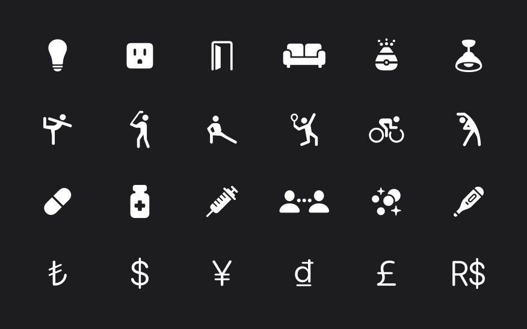
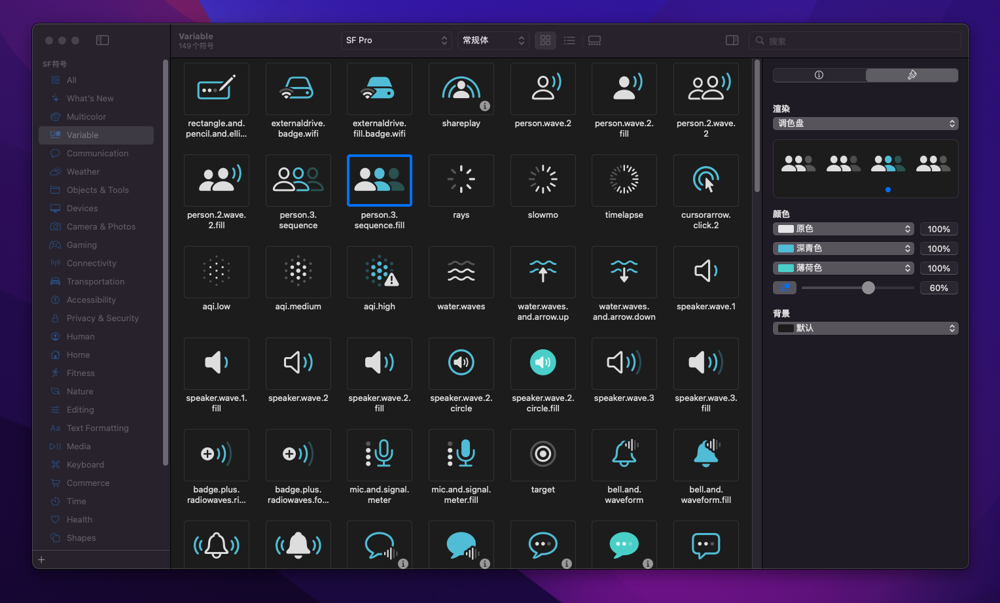
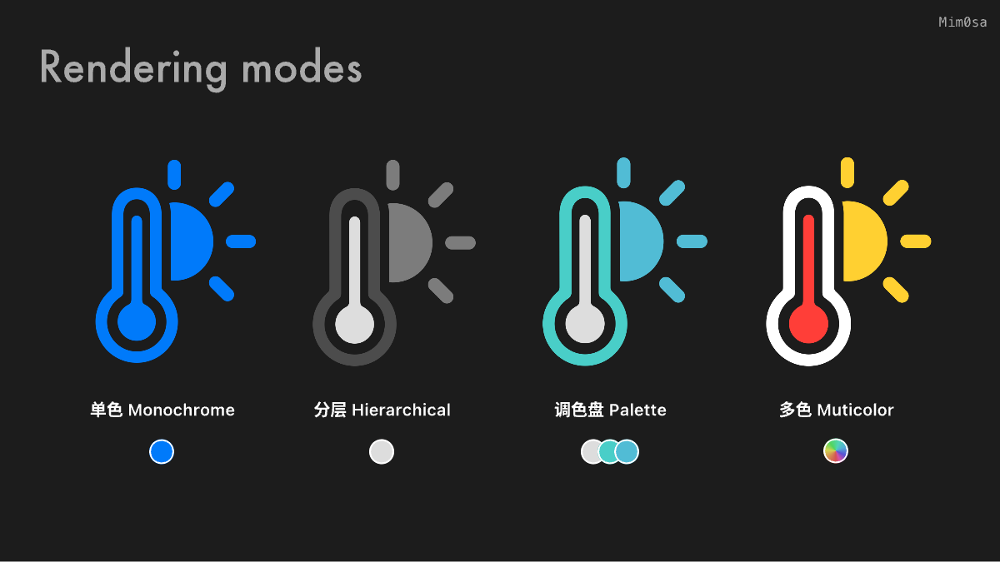
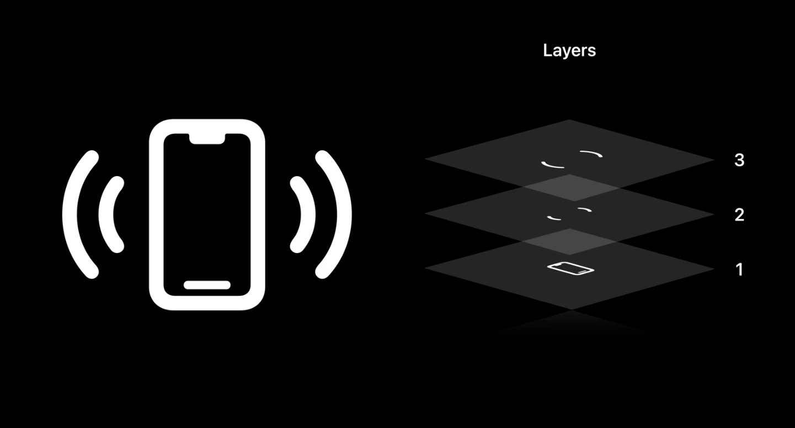
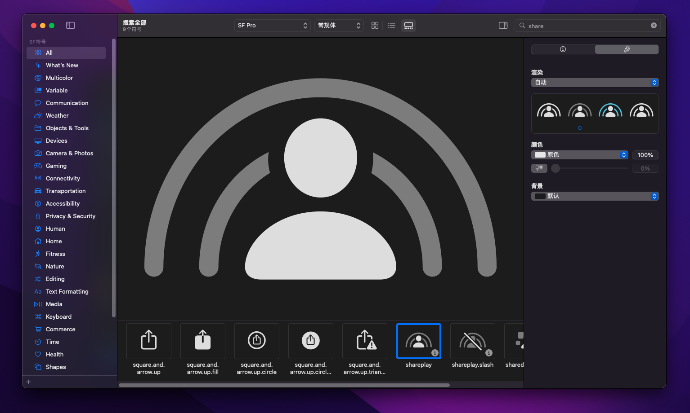
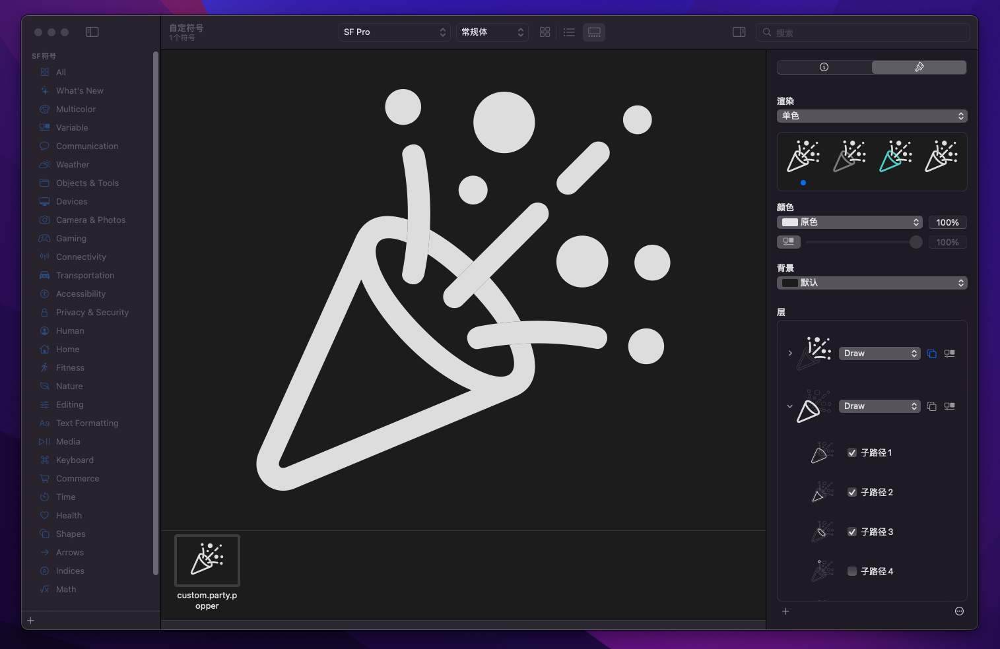
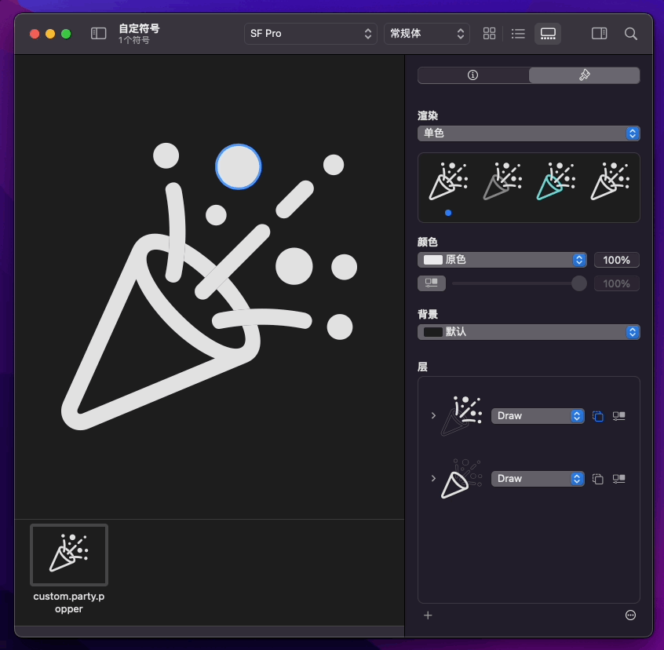
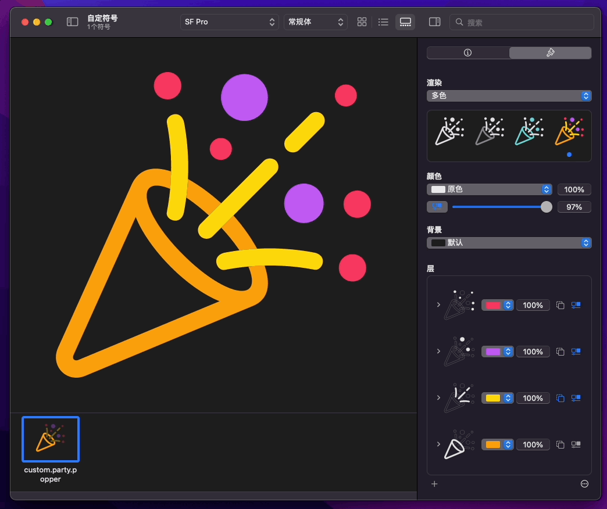
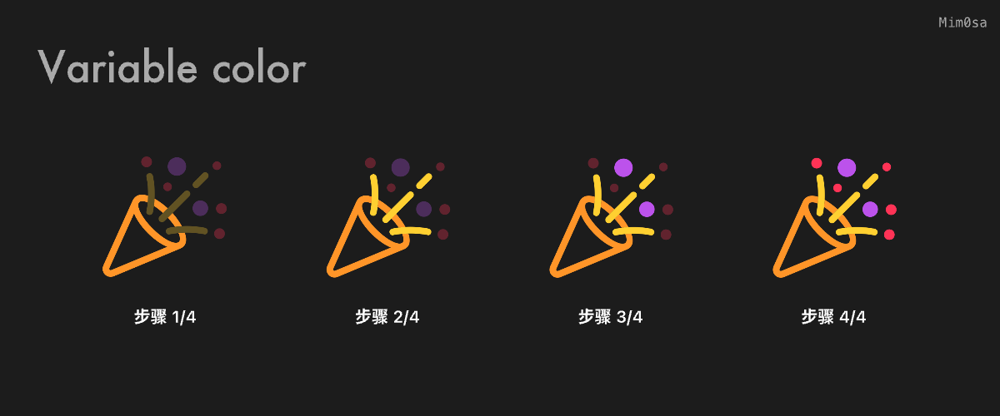
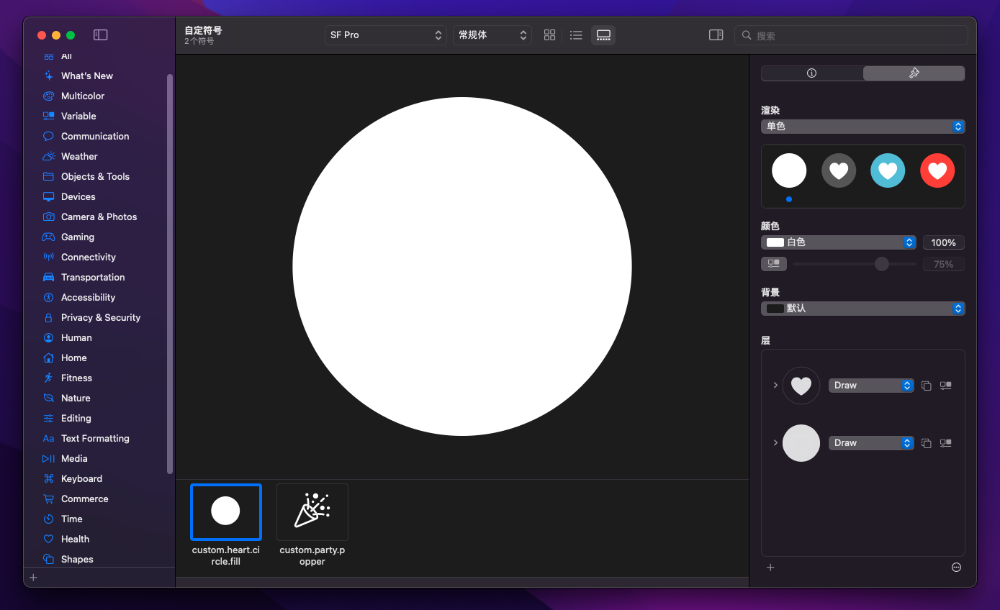

# SF Symbols 4 使用指南

> 作者：Mim0sa，iOS 开发者，`iOS 摸鱼周报` 联合编辑，掘金主页：[Mim0sa](https://juejin.cn/user/1433418892590136)，云吸猫/狗爱好者。
>
> 审核：

本文基于 WWDC 2022 [Session 10157](https://developer.apple.com/videos/play/wwdc2022/10157/) 和 [Session 10158](https://developer.apple.com/videos/play/wwdc2022/10158/) 梳理，为了更方便没有 SF Symbols 经验的读者理解，也将往年的 SF Symbols 相关内容一并整理。本文从 SF Symbols 4 的新特性切入，讨论 SF Symbols 这款由系统字体支持的符号库有哪些优点以及该如何使用。在这次 WWDC 2022 中，除了符号的数量的增加到了 4000+ 之外，还有自动渲染模式、可变符号等新特性推出，让 SF Symbols 这把利器变得又更加趁手和锋利了。

## 什么是 SF Symbols

符号在界面中起着非常重要的作用，它们能有效地传达意义，它们可以表明你选择了哪些项目，它们可以用来从视觉上区分不同类型的内容，他们还可以节约空间、整洁界面，而且符号出现在整个视觉系统的各处，这使整个用户界面营造了一种熟悉的感觉。

符号的实现和使用方式多种多样，但设计和使用符号时有一个更古不变的问题，那就是将符号与用户界面的另一个基本元素——「文本」很好地配合。符号和文字在用户界面中以各种不同的大小被使用，他们之间的排列形式、对齐方式、符号颜色、文本字重与符号粗细的协调、本地化配置以及无障碍设计都需要开发者和设计师来细心配置和协调。



为了方便开发者更便捷、轻松地使用符号，Apple 在 iOS 13 中开始引入他们自己设计的海量高质量符号，称之为 SF Symbols。SF Symbols 拥有超过 4000 个符号，是一个图标库，旨在与 Apple 平台的系统字体 San Francisco 无缝集成。每个符号有 9 种字重和 3 种比例，以及四种渲染模式，它们的默认设计都与文本标签对齐，同时这些符号是矢量的，这意味着它们是可以被拉伸的，使得他们在无论用什么大小时都会呈现出很好的效果。如果你想去创造具有相似设计特征或无障碍功能的自定义符号，它们也可以被导出并在矢量图形编辑工具中进行编辑以创建新的符号。

对于开发者来说，这套 SF Symbols 无论是在 UIKit，AppKit 还是 SwiftUI 中都能运作良好，且使用方式也很简单方便，寥寥数行代码就可以实现。对于设计师来说，你只需要为符号只做三个字重的版本，SF Symbols 会自动地帮你生成其余 9 种字重和 3 种比例的符号，然后在 SF Symbols 4 App 中调整四种渲染模式的表现，就制作好了一份可以高度定制化的 symbol。


## 如何使用 SF Symbols

### SF Symbols 4 App

在开始介绍如何使用 SF Symbols 之前，我们可以先下载来自 Apple 官方的 SF Symbols 4 App，这款 App 中收录了所有的 SF Symbols，并且记录了每个符号的名称，支持的渲染模式，可变符号的分层预览，不同语言下的变体，不同版本下可能出现的不同的名称，并且可以实时预览不同渲染模式下不同强调色的不同效果。你可以在[这里](https://developer.apple.com/sf-symbols/)下载 SF Symbols 4 App。



### 符号的渲染模式

通过之前的图片你可能已经注意到了，SF Symbols 可以拥有多种颜色，有一些 symbol 还有预设的配色，例如代表天气、肺部、电池的符号等等。如果要使用这些带有自定义颜色的符号，你需要知道，SF Symbols 在逻辑上是预先分层的（如下图的温度计符号就分为三层），根据每一层的路径，我们可以根据渲染模式来调整颜色，而每个 SF Symbols 有四种渲染模式。



#### 单色模式 Monochrome

在 iOS 15 / macOS 11 之前，单色模式是唯一的渲染模式，顾名思义，单色模式会让符号有一个单一的颜色。要设置单色模式的符号，我们只需要设置视图的 tint color 等属性就可以完成。

```swift
let image = UIImage(systemName: "thermometer.sun.fill")
imageView.image = image
imageView.tintColor = .systemBlue

// SwiftUI
Image(systemName: "thermometer.sun.fill")
    .foregroundStyle(.blue)
```

#### 分层模式 Hierarchical

每个符号都是预先分层的，如下图所示，符号按顺序最多分成三个层级：Primary，Secondary，Tertiary。**SF Symbols 的分层设定不仅在分层模式下有效，在后文别的渲染模式下也是有作用的**。



分层模式和单色模式一样，可以设置一个颜色。但是分层模式会以该颜色为基础，生成降低主颜色的不透明度而衍生出来的其他颜色（如上上图中的**温度计符号**看起来是由三种灰色组合而成）。在这个模式中，层级结构很重要，如果缺少一个层级，相关的派生颜色将不会被使用。

```swift
let image = UIImage(systemName: "thermometer.sun.fill")
let config = UIImage.SymbolConfiguration(hierarchicalColor: .lightGray)
imageView.image = image
imageView.preferredSymbolConfiguration = config

// SwiftUI
Image(systemName: "thermometer.sun.fill")
    .foregroundStyle(.gray)
    .symbolRenderingMode(.hierarchical)
```

#### 调色盘模式 Palette

调色盘模式和分层模式很像，但也有些许不同。和分层模式一样是，调色盘模式也会对符号的各个层级进行上色，而不同的是，调色盘模式允许你自由的分别设置各个层级的颜色。

```swift
let image = UIImage(systemName: "thermometer.sun.fill")
let config = UIImage.SymbolConfiguration(paletteColors: [.lightGray, .cyan, .systemTeal])
imageView.image = image
imageView.preferredSymbolConfiguration = config

// SwiftUI
Image(systemName: "thermometer.sun.fill")
    .foregroundStyle(.lightGray, .cyan, .teal)
```

#### 多色模式 Muticolor

在 SF Symbols 中，有许多符号的意象在现实生活中已经深入人心，比如：太阳应该是橙色的，警告应该是黄色的，叶子应该是绿色的的等等。所以 SF Symbols 也提供了与现实世界色彩相契合的颜色模式：多色渲染模式。当你使用多色模式的时候，就能看到预设的橙色太阳符号，红色的闹铃符号，而你不需要指定任何颜色。

```swift
let image = UIImage(systemName: "thermometer.sun.fill")
imageView.image = image
imageView.preferredSymbolConfiguration = .preferringMulticolor()

// SwiftUI
Image(systemName: "thermometer.sun.fill")
    .symbolRenderingMode(.multicolor)
```

#### 自动渲染模式 Automatic

谈论完了四种渲染模式，可以发现每次设置 symbol 的渲染模式其实也是一件费心的事情。为了解决这个问题，在最新的 SF Symbols 中，每个 symbol 都有了一个自动渲染模式。例如下图的 shareplay 符号，你可以看到在右侧面板中，shareplay 符号的第二个模式（分层模式）的下方有一个空心小圆点，这意味着该符号在代码中使用时，假如你不去特意配置他的渲染模式，那么他将使用分层模式作为他的默认渲染模式。

> 你可以在 SF Symbols 4 App 中查询到所有符号的自动渲染模式。



### 可变颜色

在有的时候，符号并不单单代表一个单独的概念或者意象，他也可以代表一些数值、比例或者程度，例如 Wi-Fi 强度或者铃声音量，为了解决这个问题，SF Symbols 引入了可变颜色这个概念。

你可以在 SF Symbol 4 App 中的 `Variable` 目录中找到所有有可变颜色的符号，平且可以通过右侧面板的滑块来查看不同百分比程度下可变颜色的形态。另外你也可以注意到，可变颜色的可变部分实际上也是一种分层的表现，但这里的分层和上文提到的渲染模式使用的分层是不同的。一个符号可以在渲染模式中只分两层，在可变颜色的分层中分为三层，下图中第二个符号喇叭 `speaker.wave.3.fill` 就是如此。关于这里的分层我们会在后文如何制作可变颜色中详细讨论。


在代码中，我们只需要在初始化 symbol 时增加一个 `Double` 类型的 `variableValue` 参数，就可以实现可变颜色在不同程度下的不同形态。值得注意的是，假如你的可变颜色（例如上图 Wi-Fi 符号）可变部分有三层，那么这个 `variableValue` 的判定将会三等分：在 0% 时将不高亮信号，在 0%～33% 时，将高亮一格信号，在 34%～67 % 时，将高亮 2 格信号，在 68% 以上时，将会显示满格信号。

```swift
let img = NSImage(symbolName: "wifi", variableValue: 0.2)
```

可变颜色的可变部分是利用不透明度来实现的，当可变颜色和不同的渲染模式结合后，也会有很好的效果。


#### 如何制作和调整可变颜色

在 SF Symbols 4 App 中，我们可以自定义或者调整可变颜色的表现，接下来我将带着大家以 `party.popper` 这个符号为基础制作一个带可变颜色的符号。

1. 首先我们打开 SF Symbols 4 App，在右上角搜索 `party.popper`，找到该符号后右键选择 `复制为1个自定符号`。推荐你在上方将符号的排列方式修改为画廊模式，如下图所示。

   

2. 可以注意到右下角的 `层` 这个板块，这个符号默认是由两个层级组成的，分别是礼花和礼花筒，同时我们也可以看到，礼花和礼花筒又分别是由更零碎的路径组成的，通过勾选子路径我们可以给每个层新增或者减少路径。那我现在想要给这个符号新增一层，我只需要在画廊模式下，将符号的某一部分拖拽到层里就可以。

   

3. 通过这样的操作，我们可以将这个符号整理为四层：礼花筒、线条礼花、小球礼花和大球礼花。为了可变颜色的效果，我们需要按照从下到上：礼花筒、线条礼花、大球礼花和小球礼花的顺序去放置层级，另外，我们可以切换到分层模式、调色板模式和多色模式里面去调整成自己喜欢的颜色来预览效果，我这里调整了多色模式中的配色，具体效果如下。

   

4. 接下来，我们将前三层，也就是除了礼花筒外的三层，最右侧的可变符号按钮选中，来表示这三层将可以在可变符号的变化范围内活动。接下来，只要点击颜色区域内的可变符号按钮，我们就可以拖动滑块来查看可变颜色的形态。

   

5. 至此，我们就完成了一个带可变颜色的自定义符号，我们可以在合适的地方使用这个符号。例如我的 App 有一个 4 个步骤的新手引导，这时候就可以给每一个步骤配备一个符号来让界面变得更加的活泼。

   

### 统一注释 Unified annotations

其实我们已经接触到了 Unified annotations 这个过程，它就是将符号的层级，路径以及子路径整理成在四个渲染模式下都能良好工作的过程，就如同上文彩色礼花筒的例子，我们通过统一注释，让彩色礼花筒符号在不同渲染模式、不同环境色、不同主题色下，都能良好的运作。

那一般来说，对于单色模式，不需要过多的调整，它就能保持良好的形态；对于分层模式和调色盘模式，我们需要在给每个层设定好哪个是 Primary 层、哪个是 Secondanry 层以及哪个是 Tertiary 层，这样系统就会按优先级给符号上合适的颜色；对于多色模式，我们可以根据喜好以及符号的意义，给它预设一个合理的颜色，另外还要注意的是，如果设计了可变颜色在符号中，那么要注意保持可变符号的效果在四个渲染模式上都表现正常。

除了这些之外，还有一些特别的地方需要注意，我们以 `custom.heart.circle.fill` 为例子。你可以注意到，这个垃圾桶符号是有一个圆形的背景的，在这种情况下，假如我们按照原来的规则去绘制单色模式，会发现：背景的圆形和爱心的图案将会是同一个颜色，那我们就将看不见圆形背景下的图案了。



这时我们可以使用 Unified annotations 给我们提供的新功能，我们将上图在 `层` 板块的爱心，将它从 Draw 改成 Erase，这样，我们就相当于以爱心的形状镂空了这个白色的背景，从而使该图形展现了出来并且在单色模式下能够一直表现正常。同理，在分层模式和调色盘模式中，也有这个 Erase 的功能共大家调整使用。

### 字重和比例

SF Symbols 和 Apple 平台的系统字体 San Francisco 一样，拥有九种字重和三种比例可以选择，这意味着每个 SF Symbol 都有 27 种样式以供使用。

```swift
let config = UIImage.SymbolConfiguration(pointSize: 20, weight: .semibold, scale: .large)
imageView.preferredSymbolConfiguration = config

// SwiftUI
Label("Heart", systemImage: "heart")
    .imageScale(.large)
    .font(.system(size: 20, weight: .semibold))
```

符号的字重和文本的字重原理相同，都是通过加粗线条来增加字重。但 SF Symbols 的三种比例尺寸并不是单纯的对符号进行缩放。如果你仔细观察，会发现对于同一个字重，但是不同比例的符号来说，他们线条的粗细是一样的，但是对符号的整体进行了扩充和延展，以应对不一样的使用环境。

要实现这样的效果，意味着每个 symbol 的底层逻辑并不是一张张图片，而是由一组组的路径构成，这也是为什么在当你想要自定义一个属于自己的 symbol 的时候，官方要求你用封闭路径 + 填充效果去完成一个符号，而不是使用一条简单路径 + 路径描边（stroke）来完成一个符号。

> 更多关于如何制作一个 symbol 的内容，请移步 [WWDC 21 内参：定制属于你的 Symbols](https://xiaozhuanlan.com/topic/4807632591)。


除了字重和比例之外，SF Symbols 还在很多方面进行了努力来方便开发者的工作，例如：符号的变体、不同语言下符号的本地化、符号的无障碍化等，关于这些内容，以及其它由于篇幅原因未在本文讨论的细节问题，请移步 [WWDC 21 内参：SF Symbols 使用指南](https://xiaozhuanlan.com/topic/9214865730)。

## 总结

从上文介绍 SF Symbols 的特性和优点我们可以看到，它的出现是为了解决符号与文本之间的协调性问题，在保证了本地化、无障碍化的基础上，Apple 一直在实用性、易用度以及多样性上面给 SF Symbols 加码，目前已经有了 4000+ 的符号可以使用，相信在未来还会有更多。这些符号的样式和图案目前看来并不是那么的广泛，这些有限的符号样式并不能让设计师安心代替所有界面上的符号，但是有失必有得，在这样一个高度统一的平台上，SF Symbols 在规范化、统一化、表现能力、代码与设计上的简易程度，在今年都又进一步的提升了，达到了让人惊艳的程度，随着 SF Symbols 的继续发展，我相信对于部分开发者来说，即将成为一个最优的符号工具🥳。

## 更多资料

以下是这几年关于 SF Symbols 的资料：

* [[ WWDC 22 ] What's new in SF Symbols 4](https://developer.apple.com/videos/play/wwdc2022/10157)
* [[ WWDC 22 ] Adopt Variable Color in SF Symbols](https://developer.apple.com/videos/play/wwdc2022/10158)
* [[ WWDC 21 内参 ] SF Symbols 使用指南](https://xiaozhuanlan.com/topic/9214865730)
* [[ WWDC 21 内参 ] 定制属于你的 Symbols](https://xiaozhuanlan.com/topic/4807632591)
* [[ Human Interface Guidelines ] SF Symbols](https://developer.apple.com/design/human-interface-guidelines/sf-symbols/overview/)
* [[ Developer ] SF Symbols](https://developer.apple.com/sf-symbols/)

以下是更早的 SF Symbols 资料：

* [[ WWDC 21 ] What’s new in SF Symbols](https://developer.apple.com/videos/play/wwdc2021/10097)
* [[ WWDC 21 ] SF Symbols in UIKit and AppKit](https://developer.apple.com/videos/play/wwdc2021/10251/)
* [[ WWDC 21 ] SF Symbols in SwiftUI](https://developer.apple.com/videos/play/wwdc2021/10349)
* [[ WWDC 21 ] Explore the SF Symbols 3 app](https://developer.apple.com/videos/play/wwdc2021/10288)
* [[ WWDC 21 ] Create custom symbols](https://developer.apple.com/videos/play/wwdc2021/10250)
* [[ WWDC 20 ] SF Symbols 2](https://developer.apple.com/videos/play/wwdc2020/10207)
* [[ WWDC 19 ] Introducing SF Symbols](https://developer.apple.com/videos/play/wwdc2019/206)
