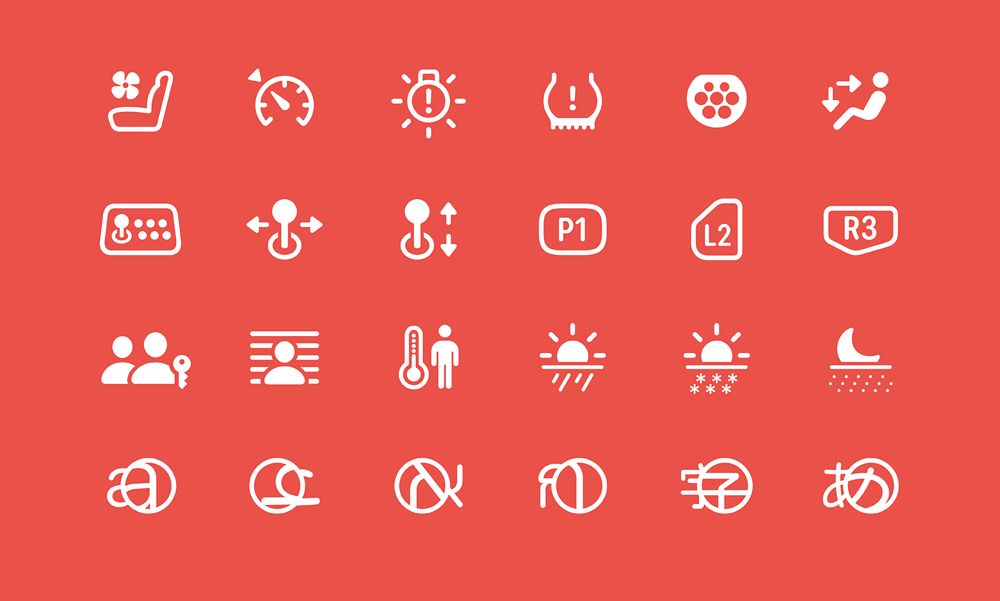
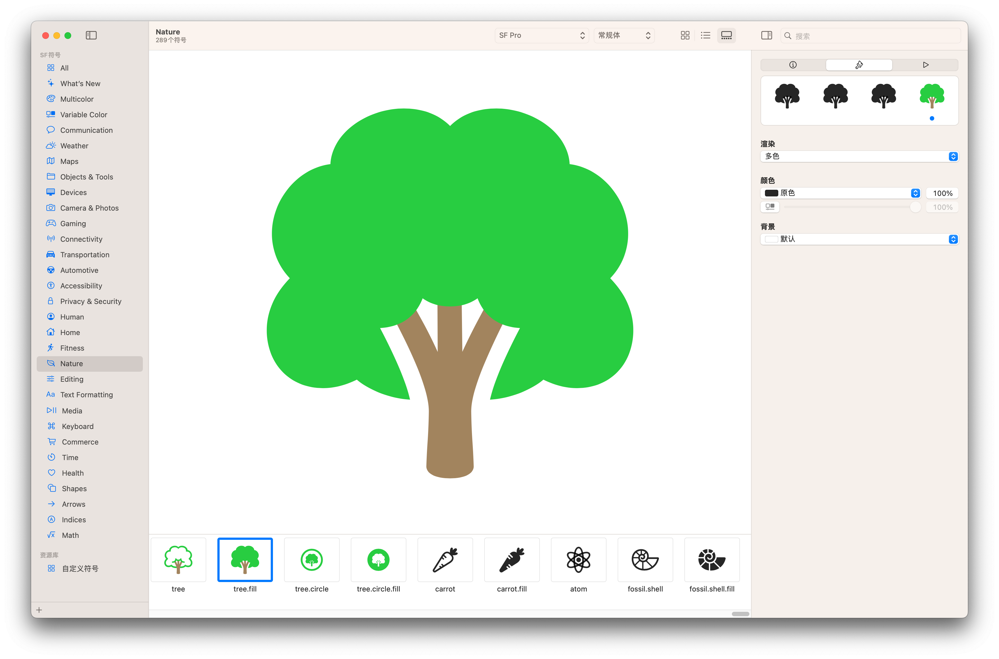
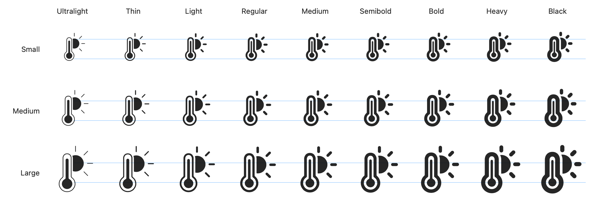
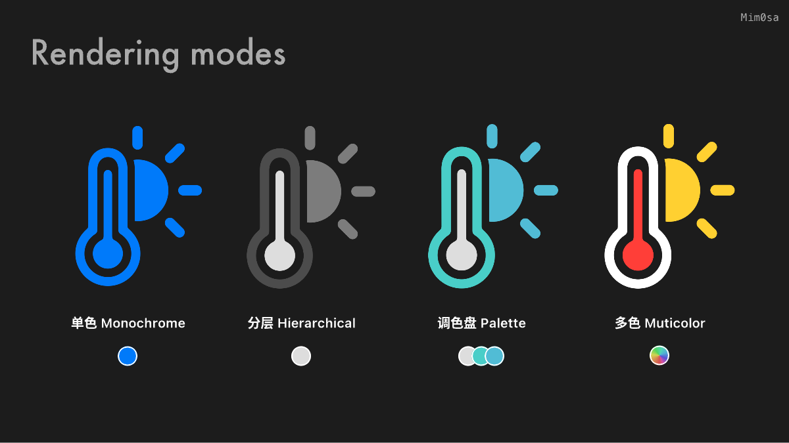
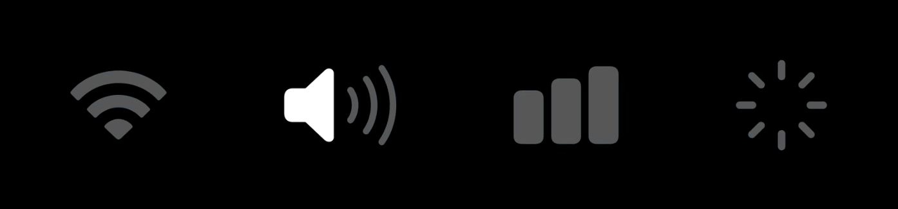
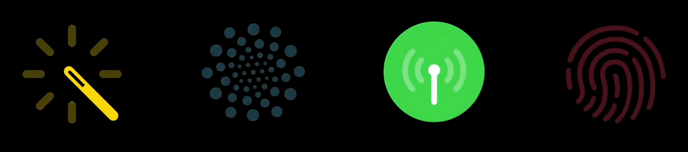
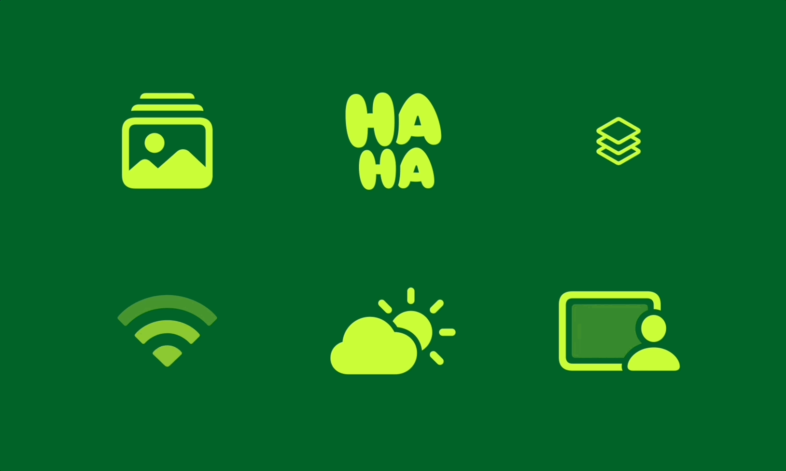
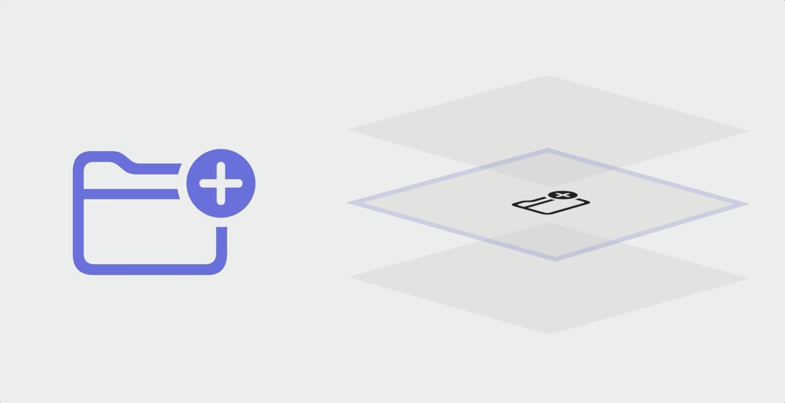

# SF Symbols 5 使用指南

> 作者：Mim0sa，iOS 开发者，`iOS 摸鱼周报` 联合编辑，掘金主页：[Mim0sa](https://juejin.cn/user/1433418892590136)，云吸猫/狗爱好者。
>
> 审核：

本文基于 WWDC 2023 [Session 10197](https://developer.apple.com/videos/play/wwdc2023/10197/)、[Session 10257](https://developer.apple.com/videos/play/wwdc2023/10257) 和 [Session 10258](https://developer.apple.com/videos/play/wwdc2023/10258) 梳理，为了更方便没有 SF Symbols 经验的读者理解，也将往年的 SF Symbols 相关内容归纳整理。本文从 SF Symbols 的特性切入，讨论 SF Symbols 这款由系统字体支持的符号库有哪些优点以及该如何使用。在这次 WWDC 2023 中，除了符号的数量的增加到了 5000+ 之外，还有能让符号们“动”起来的新功能，让 SF Symbols 这把利器变得又又更加趁手和锋利了。

## 什么是 SF Symbols

符号在界面中起着非常重要的作用，它们能有效地传达意义，它们可以表明你选择了哪些项目，它们可以用来从视觉上区分不同类型的内容，他们还可以节约空间、整洁界面，而且符号出现在整个视觉系统的各处，这使整个用户界面营造了一种熟悉的感觉。

符号的实现和使用方式多种多样，但设计和使用符号时有一个亘古不变的问题，那就是将符号与用户界面的另一个基本元素——「文本」很好地配合。符号和文字在用户界面中以各种不同的大小被使用，他们之间的排列形式、对齐方式、符号颜色、文本字重与符号粗细的协调、本地化配置以及无障碍设计都需要开发者和设计师来细心配置和协调。

为了方便开发者更便捷、轻松地使用符号，Apple 在 iOS 13 中开始引入他们自己设计的海量高质量符号，称之为 SF Symbols。SF Symbols 拥有超过 5000 个符号，是一个图标库，旨在与 Apple 平台的系统字体 San Francisco 无缝集成。每个符号有 9 种字重和 3 种比例，以及四种渲染模式，拥有可变颜色和动画的功能，它们的默认设计都与文本标签对齐。同时这些符号是矢量的，这意味着它们是可以被拉伸的，使得他们在无论用什么大小时都会呈现出很好的效果。如果你想基于已有的符号去创造属于你自己的自定义符号，它们也可以被导出并在矢量图形编辑工具中进行编辑以创建新的符号。

对于开发者来说，这套 SF Symbols 无论是在 UIKit，AppKit 还是 SwiftUI 中都能运作良好，且使用方式也很简单方便，寥寥数行代码就可以实现。对于设计师来说，你只需要为符号只做三个字重的版本，SF Symbols 会自动地帮你生成其余 9 种字重和 3 种比例的符号，就制作好了一份可以有预设动画、有四种颜色渲染模式、良好适配整个 Apple 生态的自定义符号。



## 如何使用 SF Symbols

### SF Symbols App

在开始介绍如何使用 SF Symbols 之前，我们可以先下载来自 Apple 官方的 SF Symbols 5 App，这款 App 中收录了所有的 SF Symbols，并且记录了每个符号的名称，支持的渲染模式，可变符号的分层预览，不同语言下的变体，不同版本下可能出现的不同的名称，可以实时预览不同渲染模式下不同强调色的不同效果，同时也可以预览每个符号能实现的所有种类的动画效果！你可以在[这里](https://developer.apple.com/sf-symbols/)下载 SF Symbols 5 App。



### 如何使用符号

使用 SF Symbols 非常简单，利用系统框架的 UIImage、NSImage 或者 SwiftUI 中的 Image 即可完成，你所要做的，就是去 SF Symbols App 中找到你喜欢的符号，然后复制这个符号的名字，将它粘贴到代码中即可。对于 SF Symbol 来说，我们可以调节他的字重和比例来满足搭配不同类型文字的需求，和  Apple 平台的系统字体 San Francisco 一样，SF Symbols 有有 9 种字重和 3 种比例来满足你不同场景下的使用需求。



```swift
Image(systemName: "thermometer.sun.fill")
    .fontWeight(.semibold)
    .imageScale(.large)
```

### 符号的渲染模式

通过之前的图片你可能已经注意到了，SF Symbols 可以拥有多种颜色，有一些 symbol 还有预设的配色，例如代表天气、肺部、电池的符号等等。如果要使用这些带有自定义颜色的符号，你需要知道，SF Symbols 在渲染模式的颜色逻辑上是预先分层的（如下图的温度计符号就分为三层），根据每一层的路径，我们可以根据渲染模式来调整颜色，而每个 SF Symbols 都有四种渲染模式。



#### 单色模式 Monochrome

在 iOS 15 / macOS 11 之前，单色模式是唯一的渲染模式，顾名思义，单色模式会让符号有一个单一的颜色。要设置单色模式的符号，我们只需要设置视图的 tint color 等属性就可以完成。

#### 分层模式 Hierarchical

每个符号都是预先分层的，如下图所示，符号按顺序最多分成三个层级：Primary，Secondary，Tertiary。**SF Symbols 的分层设定不仅在分层模式下有效，在后文别的渲染模式下也是有作用的**。

分层模式和单色模式一样，可以设置一个颜色。但是分层模式会以该颜色为基础，生成降低主颜色的不透明度而衍生出来的其他颜色（如上上图中的**温度计符号**看起来是由三种灰色组合而成）。在这个模式中，层级结构很重要，如果缺少一个层级，相关的派生颜色将不会被使用。

#### 调色盘模式 Palette

调色盘模式和分层模式很像，但也有些许不同。和分层模式一样是，调色盘模式也会对符号的各个层级进行上色，而不同的是，调色盘模式允许你自由的分别设置各个层级的颜色。

#### 多色模式 Muticolor

在 SF Symbols 中，有许多符号的意象在现实生活中已经深入人心，比如：太阳应该是橙色的，警告应该是黄色的，叶子应该是绿色的的等等。所以 SF Symbols 也提供了与现实世界色彩相契合的颜色模式：多色渲染模式。当你使用多色模式的时候，就能看到预设的橙色太阳符号，红色的闹铃符号，而你不需要指定任何颜色。

#### 自动渲染模式 Automatic

谈论完了四种渲染模式，可以发现每次设置 symbol 的渲染模式其实也是一件费心的事情。为了解决这个问题，每个 symbol 都有一个自动渲染模式，这意味着该符号在代码中使用时，假如你不去特意配置他的渲染模式，那么他将使用默认的渲染模式，例如 shareplay 这个符号将会使用分层模式作为默认表现。

> 你可以在 SF Symbols App 中查询和预览到所有符号的默认渲染模式是什么。

```swift
// Monochrome
Image(systemName: "thermometer.sun.fill")
    .foregroundStyle(.blue)

// Hierarchical
Image(systemName: "thermometer.sun.fill")
    .foregroundStyle(.gray)
    .symbolRenderingMode(.hierarchical)

// Palette
Image(systemName: "thermometer.sun.fill")
    .foregroundStyle(.gray, .cyan, .teal)

// Muticolor
Image(systemName: "thermometer.sun.fill")
    .symbolRenderingMode(.multicolor)
```

### 可变颜色

在有的时候，符号并不单单代表一个单独的概念或者意象，他也可以代表一些数值、比例或者程度，例如 Wi-Fi 强度或者铃声音量，为了解决这个问题，SF Symbols 引入了可变颜色这个概念。

你可以在 SF Symbol App 中的 `Variable` 目录中找到所有有可变颜色的符号，平且可以通过右侧面板的滑块来查看不同百分比程度下可变颜色的形态。另外你也可以注意到，可变颜色的可变部分实际上也是一种分层的表现，但这里的分层和上文提到的渲染模式使用的分层是不同的。一个符号可以在渲染模式中只分两层，在可变颜色的分层中分为三层，下图中第二个符号喇叭 `speaker.wave.3.fill` 就是如此。



在代码中，我们只需要在初始化 symbol 时增加一个 `Double` 类型的 `variableValue` 参数，就可以实现可变颜色在不同程度下的不同形态。值得注意的是，假如你的可变颜色（例如上图 Wi-Fi 符号）可变部分有三层，那么这个 `variableValue` 的判定将会三等分：在 0% 时将不高亮信号，在 0%～33% 时，将高亮一格信号，在 34%～67 % 时，将高亮 2 格信号，在 68% 以上时，将会显示满格信号。值得注意的是，可变颜色的可变部分是利用不透明度来实现的，当可变颜色和不同的渲染模式结合后，也会有很好的效果。

```swift
let img = NSImage(symbolName: "wifi", variableValue: 0.2)
```



但仅仅通过 value 来控制 symbol 的可变颜色形态，并不能让我们很方便的展示出如上图这样的动态效果，但是今年推出的 SF Symbol 动画效果完美的解决了这一点，也让可变颜色这个功能变得更加方便实用，我们会在后文中看到详细的动画使用方法。

### SF Symbols 新特性：Animation

在 2021 年，SF Symbols 有了不同的渲染模式，让符号们不再是单一的色调；在 2022 年，SF Symbols 获得了可变颜色功能，让符号们可以传达不同强度的状态或者是顺序。但是有没有什么东西可以让使符号更有表现力，让他在功能性、视觉上更有吸引力呢？在这次 WWDC 2023 中，SF Symbols 迎来了一个让人激动的更新：Animation，这是一种给你的界面添加活力、动感的新方式，你可以从一系列不同的可配置的动画预设中选择你想要的动画来使用。而且最重要的是，这些动画是通用的，所有的 SF Symbols 在所有的比例字重、渲染模式下，都可以良好的运作动画，这让符号们的动画变的可以高度定制化。



在我们了解怎么让符号们动起来之前，我们要重新了解一下两个概念：

首先，就是符号的图层和动画之间的关系，每个符号都有图层结构来定义它，确保符号的图层以正确的顺序排列是很重要的，这有助于决定如何对它们进行颜色处理，同时图层在一个符号的动画效果方面也起着至关重要的作用。默认情况下，一个符号将按层动画化，这意味着，每个层将在某一个时间产生动画，使符号的编排具有清晰和精确的动作。


接下来，是动画中的空间平面概念，这个空间平面指的是符号在应用运动时用来创造深度感的维度。这些平面是不可见的，但它们帮助我们理解符号如何移动和互动，使动画感觉更有吸引力。让我们这样来想象这些平面：**中间平面**是位于三维空间中心的平面，这个平面是定位和移动符号的一个参考点；**前面的平面**是最接近观看者的平面，定位在这个平面上的符号会显得更大；而**后面的平面**是离观看者最远的，符号在这个平面上会显得比较小。符号根据方向性来使用这些平面。根据动画的类型，符号可以以各种方式在平面内移动，如向上移动，或向下移动，甚至也可以完全离开观众的视线。



### 动画

目前 SF Symbols 的动画一共有 7 种，分别是：Appear, Disappear, Bounce, Scale, Variable Color, Pulse, Replace。接下来我会通过代码来展示每个动画的运作机制和特点。

#### Appear / Disappear

这里我们将 Appear 和 Disappear 放在一起说，他们两个的动画效果很相似，一个是出现，另一个是消失

#### Bounce


#### Scale


#### Variable Color

没错！我们也可以为有可变颜色特性的符号做动画，而且动画顺序将会遵循可变颜色的层级顺序来实现。要注意的是，在可变颜色中，我们可以设置部分图层完全不参与可变颜色的变化，那么在可变颜色动画中，这部分图层也完全不会参与动画。另外，为没有可变颜色特性的符号做可变颜色动画时将不会有动画效果。


#### Pulse


#### Replace


## 定制属于你的 Symbols


大纲：

1. 介绍 symbols / symbol app
2. 通过 api 展示如何使用 symbol 的以前的功能
   1. 4 mode
   2. variable color
3. 介绍新功能：animation
   1. 介绍 animations 
   2. previewing 如何在 symbol app 中使用
   3. 从 api 的角度展示所有种类的 animation
      1. symbol effect（分类介绍？貌似不需要，）
         1. discrete
         2. indefinite
         3. transition
         4. content transition
      2. apis（代码）
4. 定制 symbols
   1. animating custon symbols
   2. symbol components
