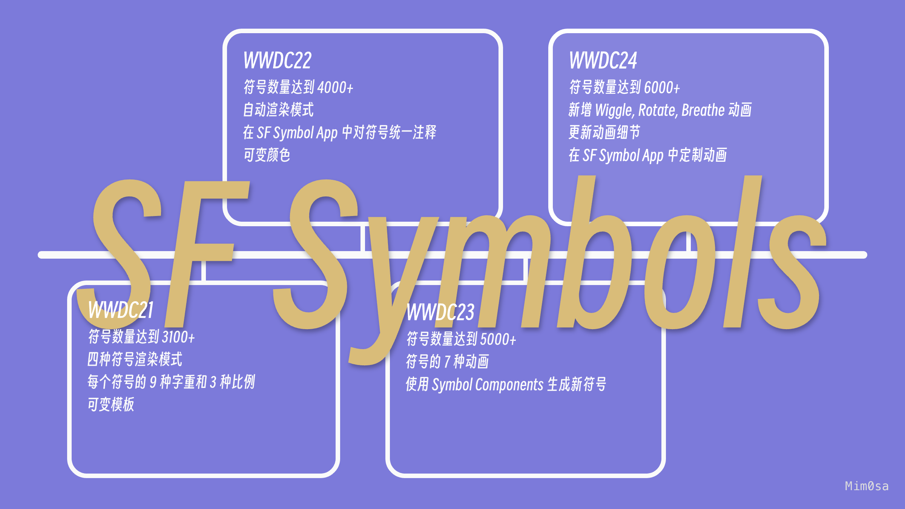

## 个人介绍

作者：Mim0sa，iOS 开发者，掘金主页：[Mim0sa](https://juejin.cn/user/1433418892590136)，橘猫/橘狗爱好者。

## 审核介绍

审核：戴铭，极客时间《iOS 开发高手课》和纸书《跟戴铭学 iOS 编程》作者。

## 不超过 120 个字的文章简介

本文基于 Session 10188 梳理，从 SF Symbols 的特性切入，讨论其有哪些特点以及该如何使用。这次更新除了符号的数量增加到了 6000+ 之外，还新增了一些能让符号们更加活泼的动画效果，同时提升整体使用体验，给界面带来了更多活力和想象力。

## 头图

