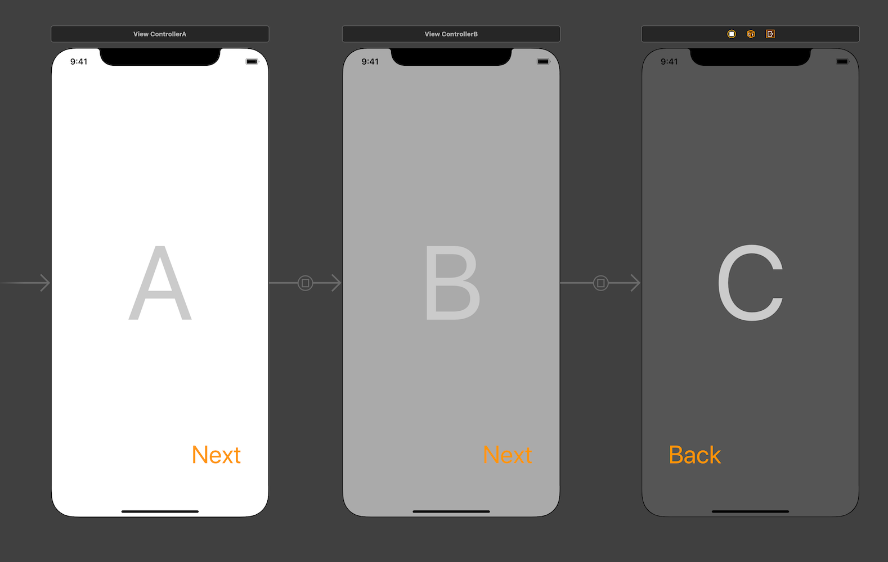
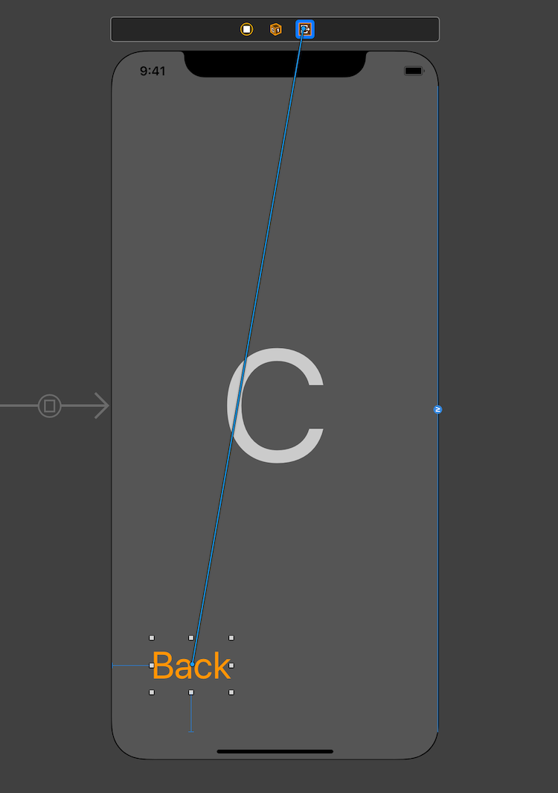
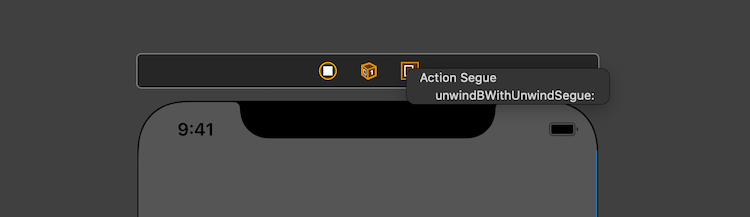
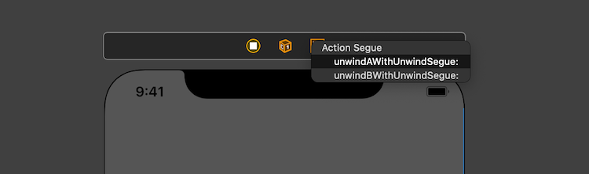
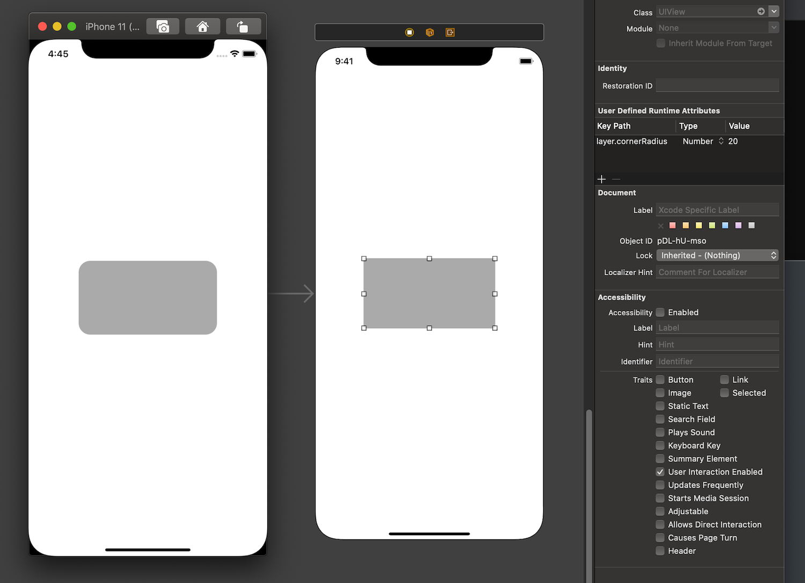
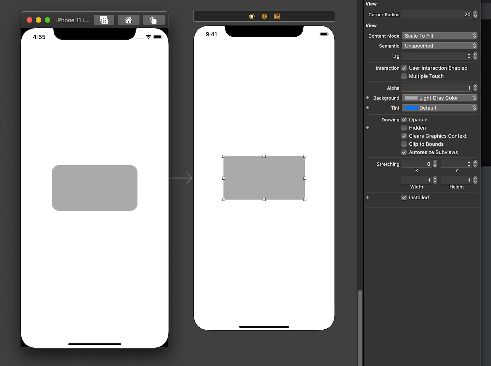
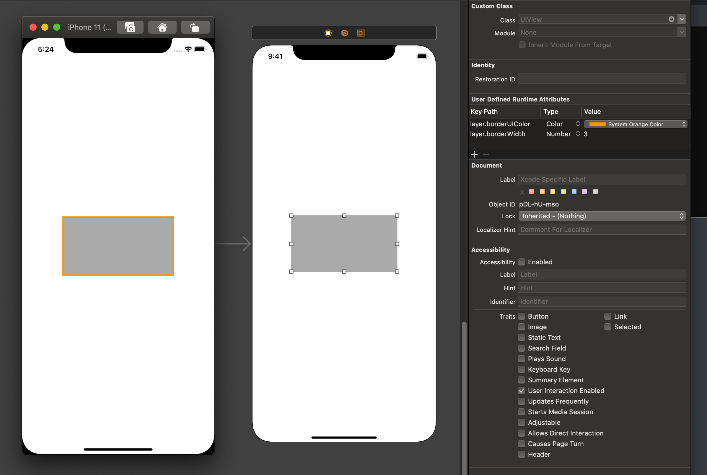

## [学习笔记] iOS | 关于 Storyboard 的一些小技巧

### 前言

用了 Storyboard 很久了，在这记录一些使用 Storyboard 时的一些小技巧和小问题。

### Unwind Segue

在 Storyboard 中，你可以简单地通过 Ctrl + 拖拽 的形式来实现点击一个按钮从页面 A 跳转到另一个指定的页面 B 。当我们要退出页面 B 时，相比使用代码的方式（例如 dismiss、pop ），Storyboard 可以使用 Unwind Segue 来使得我们的操作变得更加优雅🍷。

例如，当你有三个页面（如下图）关系为 A -> B -> C，当我们点击两次 Next 按钮到达页面 C 时，我们期望点击 Back 按钮能够退回页面 B 。



为了实现点击 Back 能够退回到页面 B 。我们首先要在页面B中添加 Unwind Segue 代码。

```swift
class ViewControllerA: UIViewController { }

class ViewControllerB: UIViewController {
    @IBAction func unwindB(unwindSegue: UIStoryboardSegue) {  }
}

class ViewControllerC: UIViewController { }
```

和平时熟悉的从 Storyboard 上拖拽 `@IBAction` 方法不同，这个方法是需要由开发者先写上去。这个方法要求要有 `@IBAction` 来让 Storyboard 捕捉到这个方法，并且由 `UIStoryboardSegue` 类型的 segue 作为参数，所以即使是写成下面这样也是可以的。

```swift
@IBAction func t(_ s: UIStoryboardSegue) {  }
```

在写好这个方法之后，在 Storyboard 中，我们通过在页面 C 中，按住 Ctrl 并拖拽 Back 按钮至页面 C 上放的 Exit 出口处松手，这时会弹出可用的 Unwind Segue，就可以连接上我们之前在页面 B 中预先写好的代码了。（所以 Unwind Segue 也有人叫 Exit Segue）





现在我们运行程序，点击两次 Next 到达页面 C 后，点击 Back 按钮，可以看到退回了页面 B ，并且你也可以在 unwind 方法中添加你想要做的退回到页面 B 之后的操作。

并且 Unwind Segue 的使用不止如此，你也可以为任意一个控制器栈上的页面添加 Unwind Segue，比如这个例子中，你可以给页面 A 添加 Unwind Segue，从而实现直接从页面 C 跳转到页面 A。

```swift
class ViewControllerA: UIViewController {
    @IBAction func unwindA(unwindSegue: UIStoryboardSegue) {  }
}

class ViewControllerB: UIViewController {  
    @IBAction func unwindB(unwindSegue: UIStoryboardSegue) {  }
}

class ViewControllerC: UIViewController { }
```




#### 关于 Unwind Segue 的一些思考

在刚开始用 Unwind Segue 时我会有疑惑：

1. 为什么这个 unwind 方法不是放在页面 C 中？
2. 放在页面 C 中的话，通过我来指定 segue 的 `destination` 我即可选择退回到哪个页面。（虽然这样操作会使 destination 不合法的可能性大大增加）
3. 平时在用纯代码实现 Dismiss / Pop 的时候，就是给页面 C 的返回按钮添加事件，点击按钮触发事件，这与 unwind 方法放在页面 C 中基本无异。

然后在偶然间，在查阅有关页面跳转的官方文档中，发现这样这样一段话：

> To dismiss a presented view controller, call the `dismissViewControllerAnimated:completion:` method of the presenting view controller. You can also call this method on the presented view controller itself. When you call the method on the presented view controller, UIKit automatically forwards the request to the presenting view controller.

简而言之，当我有一个页面 A -> 页面 B 的场景，这时我想要从页面 B 退回到页面 A，怎么做才是最符合 Apple MVC 的做法呢？

使用代码来实现的话，我需要写一个 delegateB 让页面 A 遵守，让页面 B 在点击 Back 按钮时触发 delegateB 的方法从而通知页面 A 开始销毁页面 B。由 A 展示的页面应当也由 A 来进行销毁，这样才是符合程序设计哲学的销毁方法。（猫神在他某篇博客的评论区曾经探讨过这方面的事情，但现在看不了评论了）

那使用 Unwind Segue 来实现的话，一切看起来就自然很多了，不是么？🍉

### @IBInspectable

在 Storyboard 中我们可以直接通过属性检查器面板给控件设置一些常用的属性。但遇到一些棘手的地方，比如设置 layer 的相关属性，就只能通过添加 runtime attributes 来实现。这种实现方式不可复用而且没有代码提示，用起来体验很差。

 

但有了  `@IBInspectable` 之后就比较方便了。例如我们可以给 `UIView` 的 Extension 中添加一个属性 `cornerRadius` 来映射 layer 层的 `layer.cornerRadius` 属性。这样我们就能在属性检查器面板直接设置 `UIView` 及其子类的 `layer.cornerRadius` 属性。

```swift
extension UIView {
    @IBInspectable var cornerRadius: CGFloat {
        set { layer.cornerRadius = newValue }
        get { return layer.cornerRadius }
    }
}
```



类似的我们也可以通过配置 `borderWidth` 和 `borderColor` 来实现类似效果。

```swift
extension UIView {
    @IBInspectable var cornerRadius: CGFloat {
        set { layer.cornerRadius = newValue }
        get { return layer.cornerRadius }
    }

    @IBInspectable var borderWidth: CGFloat {
        set { layer.borderWidth = newValue }
        get { return layer.borderWidth }
    }
    
    @IBInspectable var borderColor: UIColor {
        set { layer.borderColor = newValue.cgColor }
        get { return UIColor(cgColor: layer.borderColor ?? UIColor.black.cgColor) }
    }
}
```

> 另外值得一提的一点是，如果你不愿意使用属性检查器面板来设置相关属性，或者是不想给 `UIView` 扩展 `@IBInspectable` 的属性，只单纯使用 runtime attributes 来设置 `borderColor` 的话是不可行的。因为 `layer.borderColor` 这个属性接受的是 `CGColor` 而 runtime attributes 只能接受 `UIColor`。
>
> 但是你可以用 `@IBInspectable` 曲线救国，你是可以给 `CALayer` 添加 `@IBInspectable` 属性的。这样你就可以在 runtime attributes 中使用 `UIColor` 来设置 `CALayer` 的  `borderColor` 属性。（注意：这里不加 `@IBInspectable` 的话，边框将是默认的黑色。）
>
> ```swift
> extension CALayer {
>    	@IBInspectable var borderUIColor: UIColor {
>      		set { borderColor = newValue.cgColor }
>      		get { return UIColor(cgColor: borderColor ?? UIColor.black.cgColor) }
>    	}
> }
> ```
>
> 

以上是 `@IBInspectable` 的一些简单运用，但 `@IBInspectable` 能做的事情远不止如此。这里抛砖引玉给大家举几个例子感受一下：

#### 渐变色背景

这次是创建一个子类而不使用 Extension。（因为子类可以有存储属性， Extension 只能有计算属性）


说到 `@IBInspectable` 的话也不得不提和他形影不离的 `@IBDesignable`。


