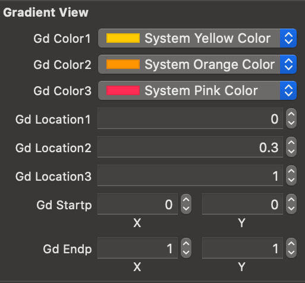
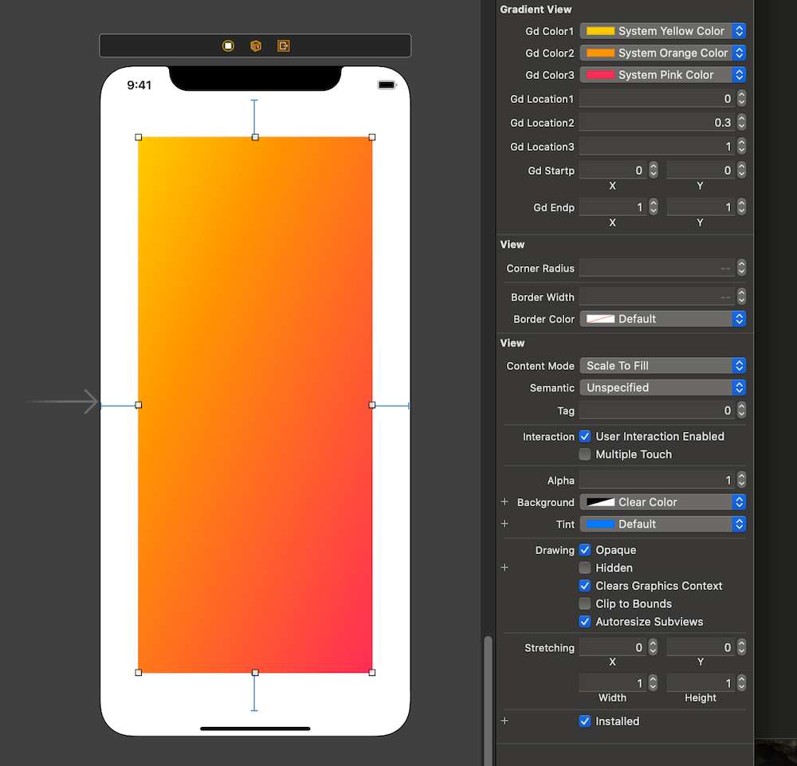
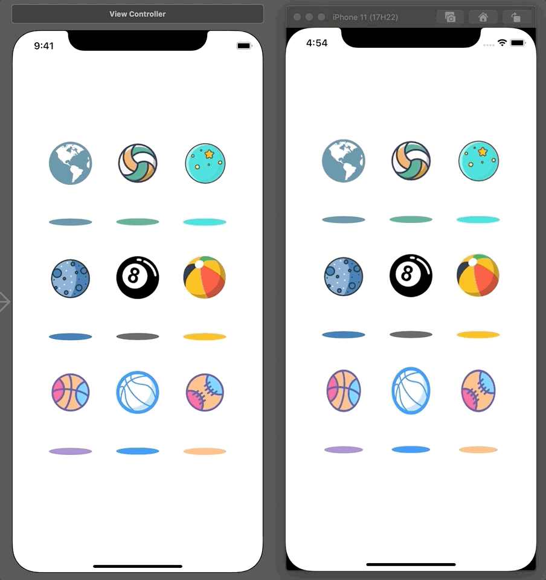
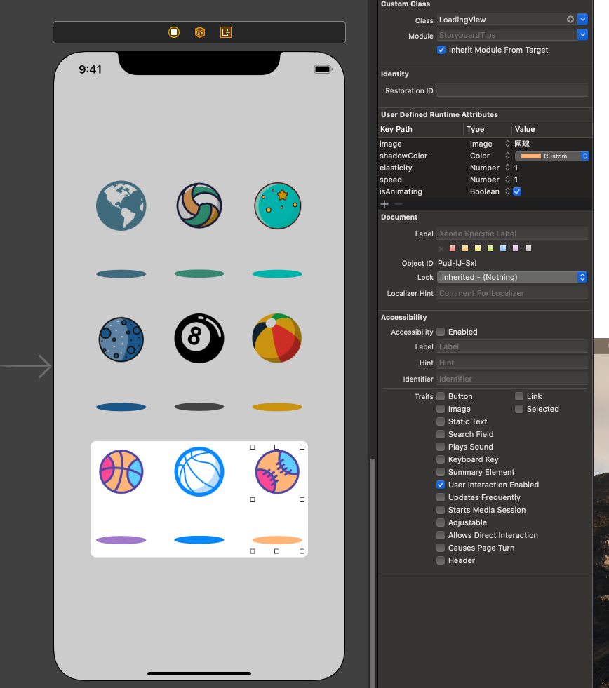
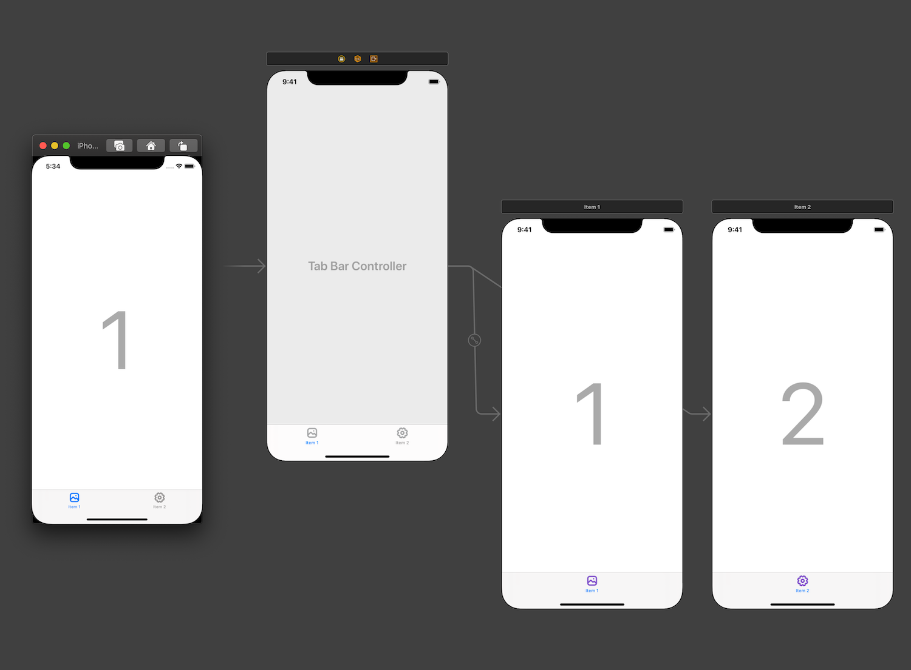
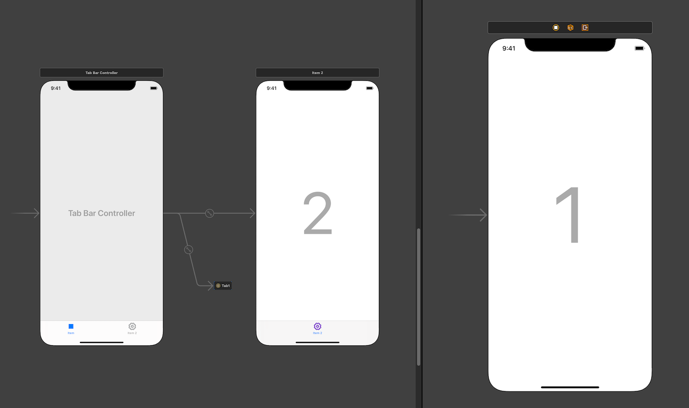
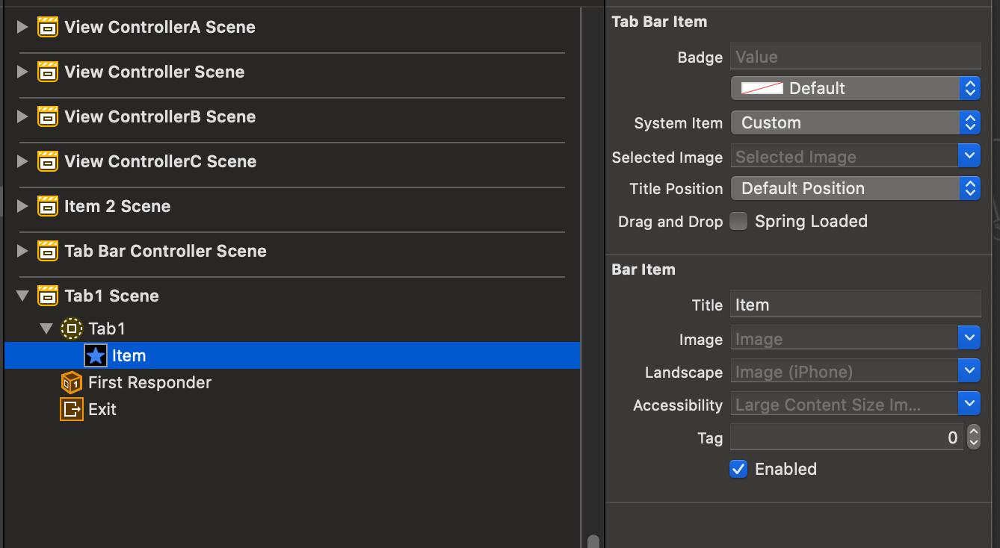
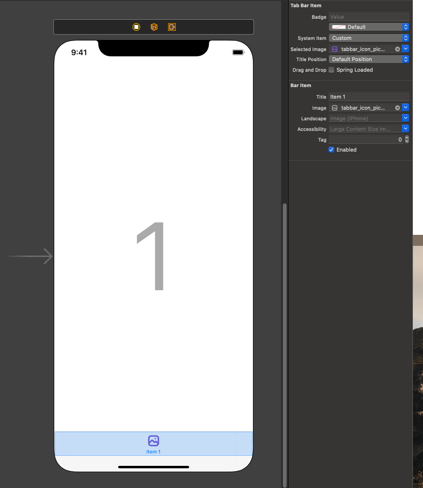

## [学习笔记] iOS | 关于 Storyboard 的一些小技巧

### 前言

用了 Storyboard 很久了，在这记录一些使用 Storyboard 时的一些小技巧和小问题。

### 1. Unwind Segue

在 Storyboard 中，你可以简单地通过 Ctrl + 拖拽 的形式来实现点击一个按钮从页面 A 跳转到另一个指定的页面 B 。当我们要退出页面 B 时，相比使用代码的方式（例如 dismiss、pop ），Storyboard 可以使用 Unwind Segue 来使得我们的操作变得更加优雅🍷。

例如，当你有三个页面（如下图）关系为 A -> B -> C，当我们点击两次 Next 按钮到达页面 C 时，我们期望点击 Back 按钮能够退回页面 B 。


为了实现点击 Back 能够退回到页面 B 。我们首先要在页面B中添加 Unwind Segue 代码。

```swift
class ViewControllerA: UIViewController { }

class ViewControllerB: UIViewController {
    @IBAction func unwindB(unwindSegue: UIStoryboardSegue) {  }
}

class ViewControllerC: UIViewController { }
```

和平时熟悉的从 Storyboard 上拖拽 `@IBAction` 方法不同，这个方法是需要由开发者先写上去。这个方法要求要有 `@IBAction` 来让 Storyboard 捕捉到这个方法，并且由 `UIStoryboardSegue` 类型的 segue 作为参数，所以即使是写成下面这样也是可以的。

```swift
@IBAction func t(_ s: UIStoryboardSegue) {  }
```

在写好这个方法之后，在 Storyboard 中，我们通过在页面 C 中，按住 Ctrl 并拖拽 Back 按钮至页面 C 上放的 Exit 出口处松手，这时会弹出可用的 Unwind Segue，就可以连接上我们之前在页面 B 中预先写好的代码了。（所以 Unwind Segue 也有人叫 Exit Segue）


现在我们运行程序，点击两次 Next 到达页面 C 后，点击 Back 按钮，可以看到退回了页面 B ，并且你也可以在 unwind 方法中添加你想要做的退回到页面 B 之后的操作。

并且 Unwind Segue 的使用不止如此，你也可以为任意一个控制器栈上的页面添加 Unwind Segue，比如这个例子中，你可以给页面 A 添加 Unwind Segue，从而实现直接从页面 C 跳转到页面 A。

```swift
class ViewControllerA: UIViewController {
    @IBAction func unwindA(unwindSegue: UIStoryboardSegue) {  }
}

class ViewControllerB: UIViewController {  
    @IBAction func unwindB(unwindSegue: UIStoryboardSegue) {  }
}

class ViewControllerC: UIViewController { }
```


#### 关于 Unwind Segue 的一些思考

在刚开始用 Unwind Segue 时我会有疑惑：

1. 为什么这个 unwind 方法不是放在页面 C 中？
2. 放在页面 C 中的话，通过我来指定 segue 的 `destination` 我即可选择退回到哪个页面。（虽然这样操作会使 destination 不合法的可能性大大增加）
3. 平时在用纯代码实现 Dismiss / Pop 的时候，就是给页面 C 的返回按钮添加事件，点击按钮触发事件，这与 unwind 方法放在页面 C 中基本无异。

然后在偶然间，在查阅有关页面跳转的官方文档中，发现这样这样一段话：

> To dismiss a presented view controller, call the `dismissViewControllerAnimated:completion:` method of the presenting view controller. You can also call this method on the presented view controller itself. When you call the method on the presented view controller, UIKit automatically forwards the request to the presenting view controller.

简而言之，当我有一个页面 A -> 页面 B 的场景，这时我想要从页面 B 退回到页面 A，怎么做才是最符合 Apple MVC 的做法呢？

使用代码来实现的话，我需要写一个 delegateB 让页面 A 遵守，让页面 B 在点击 Back 按钮时触发 delegateB 的方法从而通知页面 A 开始销毁页面 B。由 A 展示的页面应当也由 A 来进行销毁，这样才是符合程序设计哲学的销毁方法。（猫神在他某篇博客的评论区曾经探讨过这方面的事情，但现在看不了评论了）

那使用 Unwind Segue 来实现的话，一切看起来就自然很多了，不是么？🍉

### 2. @IBInspectable 和  @IBDesignable

在 `Storyboard` 中我们可以直接通过属性检查器面板给控件设置一些常用的属性。但遇到一些棘手的地方，比如设置 `layer` 的相关属性，就只能通过添加 runtime attributes 来实现。这种实现方式不可复用而且没有代码提示，用起来体验很差。

 

但有了  `@IBInspectable` 之后就比较方便了。例如我们可以给 `UIView` 的 Extension 中添加一个属性 `cornerRadius` 来映射 `layer` 层的 `layer.cornerRadius` 属性。这样我们就能在属性检查器面板直接设置 `UIView` 及其子类的 `layer.cornerRadius` 属性。

```swift
extension UIView {
    @IBInspectable var cornerRadius: CGFloat {
        set { layer.cornerRadius = newValue }
        get { return layer.cornerRadius }
    }
}
```


类似的我们也可以通过配置 `borderWidth` 和 `borderColor` 来实现类似效果。

```swift
extension UIView {
    @IBInspectable var cornerRadius: CGFloat {
        set { layer.cornerRadius = newValue }
        get { return layer.cornerRadius }
    }

    @IBInspectable var borderWidth: CGFloat {
        set { layer.borderWidth = newValue }
        get { return layer.borderWidth }
    }
    
    @IBInspectable var borderColor: UIColor {
        set { layer.borderColor = newValue.cgColor }
        get { return UIColor(cgColor: layer.borderColor ?? UIColor.black.cgColor) }
    }
}
```

> 另外值得一提的一点是，如果你不愿意使用属性检查器面板来设置相关属性，或者是不想给 `UIView` 扩展 `@IBInspectable` 的属性，只单纯使用 runtime attributes 来设置 `borderColor` 的话是不可行的。因为 `layer.borderColor` 这个属性接受的是 `CGColor` 而 runtime attributes 只能接受 `UIColor`。
>
> 但是你可以用 `@IBInspectable` 曲线救国，你是可以给 `CALayer` 添加 `@IBInspectable` 属性的。这样你就可以在 runtime attributes 中使用 `UIColor` 来设置 `CALayer` 的  `borderColor` 属性。（注意：这里不加 `@IBInspectable` 的话，边框将是默认的黑色。）
>
> ```swift
> extension CALayer {
>     @IBInspectable var borderUIColor: UIColor {
>         set { borderColor = newValue.cgColor }
>         get { return UIColor(cgColor: borderColor ?? UIColor.black.cgColor) }
>     }
> }
> ```
>
> 

以上是 `@IBInspectable` 的一些简单运用，但 `@IBInspectable` 能做的事情远不止如此。这里抛砖引玉给大家举两个例子感受一下：

#### 渐变色背景

我们先来看一下一个普通的渐变色背景是如何实现的：

```swift
override func viewDidLoad() {
    super.viewDidLoad()

    let gradientLayer = CAGradientLayer()
    gradientLayer.colors = [UIColor.yellow.cgColor, UIColor.orange.cgColor, UIColor.red.cgColor]
    gradientLayer.locations = [0.0, 0.4, 1.0]

    gradientLayer.startPoint = CGPoint(x: 0, y: 0)
    gradientLayer.endPoint = CGPoint(x: 1, y: 1)

    gradientLayer.frame = view.bounds
    view.layer.insertSublayer(gradientLayer, at: 0)
}
```

可以看到要实现渐变色背景我们需要若干个颜色以及对应若干个 location，以及两个 `CGPoint` 类型的坐标来表达渐变的方向，最后是通过生成一个 `CAGradientLayer` 插入当前的视图。根据这些要求，我们可以利用 `@IBInspectable` 来在 `Storyboard` 中设置这些信息，首先我们要新建一个 `UIView` 的子类叫做 `GradientView`，并在类内部声明一些属性和方法，代码中的注释详细描述了各个属性和指令的作用。

> 这里选择新建一个子类而不是使用 Extension 的原因是在实现这个效果时我们需要用到存储属性而 Extension 只能存放计算属性。

```swift
class GradientView: UIView {
    // 三个渐变的颜色
    @IBInspectable var gdColor1: UIColor?
    @IBInspectable var gdColor2: UIColor?
    @IBInspectable var gdColor3: UIColor?
    // 三个渐变颜色的 Location
    @IBInspectable var gdLocation1: Float = 0
    @IBInspectable var gdLocation2: Float = 1
    @IBInspectable var gdLocation3: Float = 1
    // 控制渐变方向的两个点
    @IBInspectable var gdStartp: CGPoint = CGPoint(x: 0, y: 0)
    @IBInspectable var gdEndp: CGPoint = CGPoint(x: 1, y: 0)
    // 一个 CAGradientLayer 实例
    var gdLayer = CAGradientLayer()
    
    // 配置并添加渐变背景到当前视图上的方法
    private func makeGradientLayer() {
        // 如未设置颜色则退出该方法
        guard let c1 = gdColor1, let c2 = gdColor2, let c3 = gdColor3 else { return }
        // 因为调用时机是在 layoutSubviews() 上，所以要先将之前添加的背景先移除再生成新的
        gdLayer.removeFromSuperlayer()
        // 设置三个渐变颜色及其 Location
        gdLayer.colors = [c1.cgColor, c2.cgColor, c3.cgColor]
        gdLayer.locations = [NSNumber(value: gdLocation1),
                             NSNumber(value: gdLocation2),
                             NSNumber(value: gdLocation3)]
        // 设置控制渐变方向的两个点
        gdLayer.startPoint = gdStartp
        gdLayer.endPoint = gdEndp
        // 设置 layer 的尺寸
        gdLayer.frame = bounds
        // 添加该 layer 到视图最底层
        layer.insertSublayer(gdLayer, at: 0)
    }
    // 这里把该方法放在 layoutSubviews() 中作为例子，为了表现屏幕旋转后仍运作良好，方便理解。
    override func layoutSubviews() {
        super.layoutSubviews()
        // 实际该方法不一定要放在此处（也不应该放在此处）
        makeGradientLayer()
    }
}
```

写完这些我们再去 `Storyboard` 里，拖一个普通的 `UIView` 到屏幕上，将它的类设置成我们写的 `GradientView`，就可以在属性控制器面板看到这些被 `@IBInspectable` 修饰的属性。并且通过以下简单的设置，你就可以给你的视图配置上带三种颜色的渐变背景。我在这边给 `GradientView` 添加了边距 50 的约束，让我们来旋转看看效果！




如果你的 Mac 性能不错，也可以在  `GradientView` 类前加一个 `@IBDesignable`，这样你就可以在 `Storyboard` 中实时看到效果。

```swift
@IBDesignable class GradientView: UIView { ... }
```



#### 动画

先给大家看一下效果，在这个例子中可以定制的属性是图片（球）、阴影颜色、弹跳速度、球的弹性以及是否开启动画。



可以看到这其实是9个类似的视图，做法和之前是比较类似的，在这就不详细解释代码了。

```swift
class LoadingView: UIView {
    @IBInspectable var image: UIImage?
    @IBInspectable var shadowColor: UIColor? { didSet { makeViews() } }
    @IBInspectable var elasticity: CGFloat = 1
    @IBInspectable var speed: Double = 1
    @IBInspectable var isAnimating: Bool = true { didSet { if isAnimating { animate() } } }
    
    let ballImageView = UIImageView()
    let ballShadowView = UIView()
    
    let contentRatio: CGFloat = 1.8
    lazy var contentWidth = contentRatio * frame.width > frame.height
                            ? frame.height / contentRatio
                            : frame.width
    lazy var contentHeight = contentRatio * contentWidth
    
    func makeViews() {
        ballShadowView.frame.size = CGSize(width: contentWidth, height: contentWidth / 6)
        ballShadowView.center = CGPoint(x: frame.width / 2,
                                        y: frame.height / 2 + contentHeight / 2 - contentWidth / 12)
        ballShadowView.backgroundColor = shadowColor
        
        let pathLayer = CAShapeLayer()
        pathLayer.path = UIBezierPath(ovalIn: ballShadowView.bounds).cgPath
        ballShadowView.layer.mask = pathLayer
        
        addSubview(ballShadowView)
        
        ballImageView.image = image
        ballImageView.contentMode = .scaleToFill
        ballImageView.frame.size = CGSize(width: contentWidth, height: contentWidth)
        ballImageView.center = CGPoint(x: frame.width / 2,
                                       y: frame.height / 2 - (frame.height / 2 - ballImageView.frame.height / 2))
        addSubview(ballImageView)
    }
    
    func animate() {
        UIView.animateKeyframes(withDuration: TimeInterval(speed), delay: 0,
                                options: .calculationModeCubicPaced, animations: {
            UIView.addKeyframe(withRelativeStartTime: 0, relativeDuration: self.speed / 2) {
                self.ballShadowView.transform = CGAffineTransform(scaleX: 0.1, y: 0.1)
                                                                 .scaledBy(x: self.elasticity, y: 1)
                self.ballImageView.transform = CGAffineTransform(translationX: 0, y: self.contentHeight - self.contentWidth)
                                                                 .scaledBy(x: 1 / self.elasticity, y: self.elasticity)
            }
            UIView.addKeyframe(withRelativeStartTime: self.speed / 2, relativeDuration: self.speed / 2) {
                self.ballShadowView.transform = CGAffineTransform.identity.scaledBy(x: self.elasticity, y: 1)
                self.ballImageView.transform = CGAffineTransform.identity.scaledBy(x: self.elasticity, y: 1 / self.elasticity)
            }
        }) { (finished) in
            self.animate()
        }
    }
}
```

>  一个可能让人感觉疑惑的点是：为什么选择了 `shadowColor` 和 `isAnimating` 的 `didSet` 作为我创建视图和启动动画的时机？能保证其他属性一定在该属性之前被赋值吗？答案是：不能。如果你和我一样懒，选择使用某个属性的 `didSet` 作为某些事件发生的时机，且在这个时机你需要其他属性已经被正确赋值，那你需要保证在 `Storyboard` 面板中，那个属性是最后被设置的（或者尽量靠后），换一句话说就是：当你设置完所有属性时，你可以去身份检查器的 runtime attributes 中检查你的那个属性是不是尽量靠后，下图显示了我的 `isAnimating`  属性是相对靠后的。（这个例子中 `shadowColor` 属性靠不靠后无所谓）
>
> 
>
> 另外，`@IBDesignable` 并不能对动画、Timer等事件作出反应（貌似），所以不要妄想加上 `@IBDesignable` 后能在 `Storyboard` 中看到动画👻。
>
> 如果你真的很想弄出动画来，试试SwiftUI吧！🤪

### 3. Storyboard Reference

这个大家应该都知道，为了避免一个超级庞大的 `Storyboard` 文件，我们可以建立若干个 `Storyboard` 文件并用 `Storyboard Reference` 把它们联系起来。有两种方法实现这个效果：

1. 在 `Storyboard` 中选中你要分离的控制器，选择 Editor -> Refactor to Storyboard -> 选择路径和名字，就完成了

2. 从控件库中拖一个 `Storyboard Reference` 出来，并连接上某个控制器，在 `Storyboard Reference` 的属性面板可以设置目标 `Storyboard` 文件的名字，然后目标文件的 `Initial View Controller` 就会成为被展示的控制器。

在这我简单演示一下过程并展示一个我遇到过的问题。

#### 遇到的一个问题

我现在有一个 `Storyboard ` 文件及其运行效果如下图：



我现在想要分离第一个 Tab 到别的文件，也就是 1 号页面，我按照方法一操作，选择 Editor -> Refactor to Storyboard -> 选择路径和名字，得到如下效果：



现在两部分已经分离了，正常来说这是一个圆满结束，但不知道你有没有注意到 Tabbar 上的图标变了，这时如果你是较低版本的 iOS 系统支持，运行之后也会是这一个蓝色方块，但高版本好像又没有这个问题。我试图选择那个  `Storyboard Reference`，更改他 item 上的图标以及名称，可以更改但没有效果。



#### 解决方案

最后我找的解决办法令人匪夷所思，是在刚刚新建的那个 `Storyboard` 文件中，给那个 tab1 从控件库中自己拖一个 tabbar item 上去装装样子设置一下，就好了诶🥶。



### 后记

说了这么多，想要告诉大家的是：俗话说得好，一图胜千言，纯代码看起来真的很不享受，也没有那种优雅的感觉，如果你想变成一个优雅的 iOS 程序员，知道该怎么做了么？ 

所以大家快去用 SwiftUI 吧！


