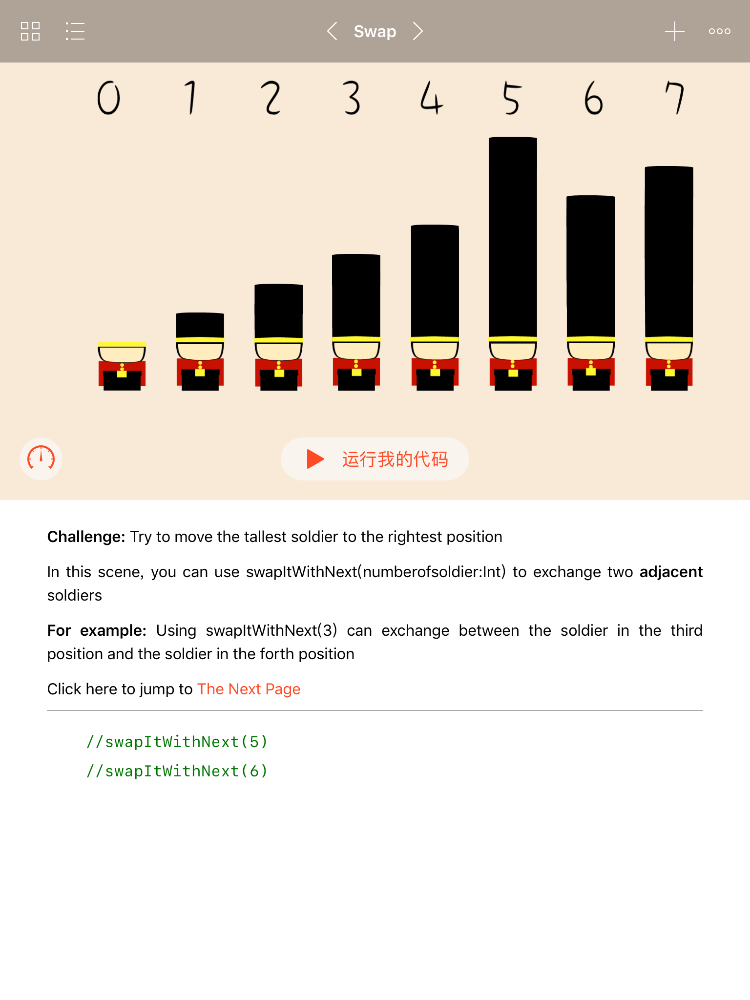
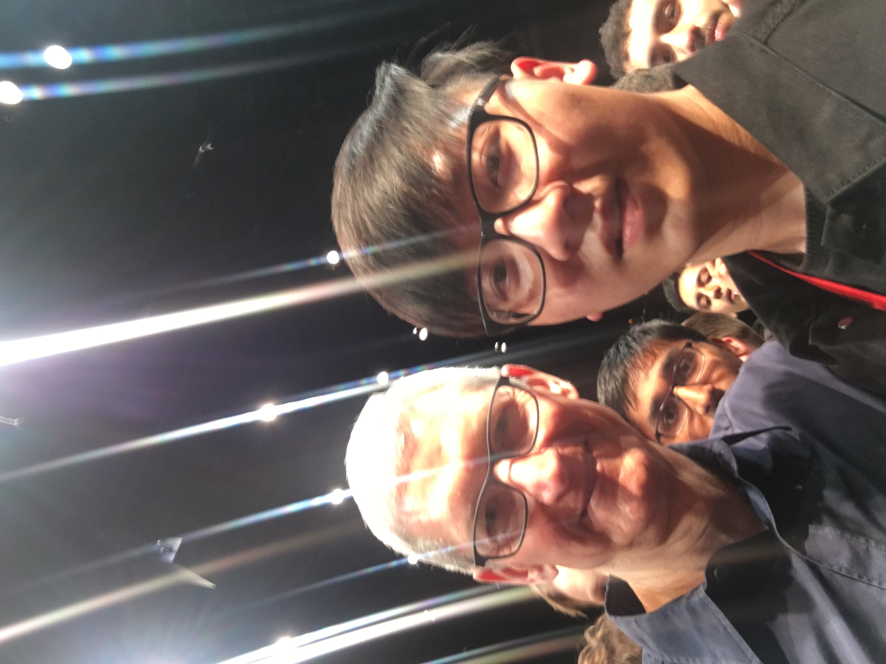

# [访谈] Mimosa

### 简单介绍下自己吧

哈咯大家好，我是 Mimosa，中文谐音名棉毛衫，小号是 Mimoku（棉毛裤），是一名 iOS 开发者，工作经验一年左右，是 iOS 摸鱼周报的编辑之一。我是在大学的时候接触的 iOS 开发，当时加入了学校的 iOS Club，在大二那年获得了来自 Apple 的 WWDC Scholarship Winner，从此算是与 iOS 开发结缘，参加了许多与 iOS 相关的活动，毕业到如今一直是从事 iOS 开发。

### 能讲下自己获得 WWDC 奖学金的经历吗？

首先先介绍一下这个奖学金吧，WWDC Scholarship Winner 是 Apple 每年为全球学生提供的一个小福利，每年 4 月份的时候，Apple 会在官网放出当年 Scholarship 的要求，比如你需要是一个学生，你不能年龄太小等等，你还需要做一个有创意、激动人心的小作品，并提交，全球每年将会有大约 350 名学生的作品会被接收。如果你的作品被接收了，那么将免费获得一张当年 6 月份参加 WWDC 的门票，价值 $1599 😎（且提供住宿、来回差旅费也有机会报销）。在 2020 年之后，这个奖学金改名叫做 Swift Student Challenge 了，且由于疫情这两年的 WWDC 改为线上，就无法去现场参加了。

我获得的是 17 年的奖学金，申请 WWDC 奖学金时我正值大二，当时是刚学完学校的 C 语言课程和数据结构，加入了我们学校的 iOS Club，也是第一次接触 iOS 开发。我还清晰的记得当时是在 Swift 3.0 的环境下用 Swift 2.0 的教学视频在自学😂，周围会 Swift 的人也是屈指可数，只能自己上网摸索。由于当时有学长获得过上一年的 WWDC 奖学金（但由于时间问题没去 WWDC 现场），所以当时的刚学我们也想试一试，就熬了几天用自己学过的所有东西做了一个作品提交了。没成想那年我们学校有 4 位同学获得了奖学金！但最后由于签证问题（我是之前已经有申根和美签了，但我的朋友们没有🥲），所以只有我一个人去圣何塞 WWDC 的现场。

[WWDC 现场图]

### 你当时开发的是什么作品？
那一年是第一次 Apple 要求参赛者制作一个 playground（之前都是要求做一个介绍自己的 App 这种类型的题目），我制作了一个简单又可爱的可视化冒泡排序教程💂‍♀️，运行在 Swift Playgrounds 这个 App 中（可以在 iPad App Store 和 Mac App Store 中找到这个 App），利用这个 App 一侧可以写代码，一侧可以查看运行结果这种所见即所得的特性，来教使用者冒泡排序算法的原理。

### 参加 WWDC 期间有什么好玩的事情，这个过程有什么收获？

可以说是收获颇丰。首先一个是，作为 Scholarship Winner 可以额外参加一个 WWDC 正式开幕之前的 WWDC Scholarship Meeting，由 Apple 组织在一个小剧场和我们讲了一点 Apple 在各个方面做出的一些努力等等，还会给我们发一个 dev 版本的 Apple TV。重要的是，在所有演讲结束后，Tim Cook 会突然走出来和所有 Scholarship Winner 合影，然后接下来就是激动人心的和 Tim Cook 合影环节，我当时的情况是你只需挤到他旁边他就会和你合照一张！🤩据我观察现场大约有 2/3 的人都在成功合影了。（剩下没合影成功的只能落寞地望着 Tim Cook 和他保镖的背影😇

对于大多数开发者来说，可能 WWDC 里面重要的是各种各样的 session，但其实也会有一些无关技术但与生活相关的演讲，给我印象深刻的有两个。一个是在 WWDC 的第二天，由于我时差没倒过来睡不着，参加的当天最早的一个演讲，是奥巴马夫人米歇尔的一个演讲，（虽说我排队时排在前几个但是仍没坐到前排，气死了），她讲了许多科技与生活的事情，谈论了他的孩子，还讲了去长城的经历，吐槽长城人太多了等等。另有一个让我印象深刻的演讲是来自 NASA 的一个女数学家奶奶，她谈论了她当年是怎么加入 NASA 以及工作至退休期间的经历，讨论了那个年代女性在 NASA 的情况，讨论了那个年代女科学家的境地，让我大受震撼。

[米歇尔照片]

作为 Scholarship Winner 还有一大好处就是，除了能接触到说中国话的学生开发者之外，还可以接触到来自世界各地的 Scholarship Winner，由于所有 Winner 住在圣何塞州立大学的宿舍里，我去的那年 350 个 Winner 中大概只有15个是来自大陆，同时黄皮肤的面孔不超过30个，意味着活动中有大量的时间我需要与母语不是中文的人交流。比如我的室友就来自俄罗斯🇷🇺，他大四在读，我们用散装英语交流了很多东西，他的作品是用 playgrounds 模拟 Metal（？我到现在也没懂这怎么做的😅），他的计算机基础踏实的一塌糊涂，聊天的时候我就像被面试一样，绞尽脑汁地想他到底在说啥。还有一位意大利小哥🇮🇹一看我这是亚洲人面孔，就凑上来问我们是哪里人，问我是不是中国人，问我来自上海嘛，在得到一系列肯定的答复后他说他去同济大学交流过一段时间，然后他突然很想告诉我他是哪个校区，然后我们开始一起苦思冥想同济大学除了四平路还有在哪的校区，想了半天没想出来，意大利小哥也不尴尬，和我面面相觑地走了一路，最后挥手道别😂。

[合照]

在 WWDC 期间的会场外，也会有很多的 tech talk 在附近举办（蹭 WWDC 热度），我误打误撞参加了一个 Realm 举办的 tech talk，一开始先是吹了一波 Realm，然后是邀请了一些从 Apple 离职的人来做对话，结果发现请到了 Chris Lattner（当时就职于特斯拉），大家伙那叫一个激动啊， 连下面的好多爷爷辈的听众都提了好几个问题（真的爷爷辈，拄拐杖的，不开玩笑），只能感叹一下计算机技术这该死的魅力。另外 WWDC 的倒数第二天有个 Bash，算是一场露天音乐会，气氛很热烈！来的是 Fall Out Boy（代表作有"The Phoenix"，"Immortals"等，现场太顶了），大家在现场把酒言欢，给 WWDC 收了个尾。在 Bash 现场还和来自国内各大互联网公司的工程师们合影了，不知道各位看官有没有在照片里面的。

[大合照]

在 WWDC 玩的这几天拓宽了我看待技术的视野，把我从学校里教的那些知识里面拉了出来，在会场的内外，看到了更多与业界发展相关的东西，看到了计算机科学的广度和深度。我本科就读于魔都某不知名二本，且不是工科强校，所以我的学校计算机专业水平比起其他获得奖学金的同学的学校来说（我记得有中大、同济、新国大、中科大、港大等🙂）差的不是一点半点，无意贬低我的母校，但确实这次的经历让我觉得我能努力的地方原来还有这么多，我在学校所认识到的那些知识似乎只是计算机科学的冰山一角，突然在心中对一些东西产生了渴望，让我突然对未来感到期待和兴奋，在这些经历和感受一起冲击我心灵之后，我知道了一件事：我掉进代码这个陷阱里了🥰。

### 你在上海科技馆和 Apple 供应链工厂等场合进行过一些线下演讲和交流，这是一种什么体验？

### 参加社团并做出一定的成绩是需要持续不断的学习的，你的学习方法是什么？如何保持这种不断学习的热情？

### 听说明年初想换工作，能说下你对新工作的要求吗？

不瞒大家说，我有点想去拍电影🤡。

### 有什么想借助摸鱼周报宣传的？

希望大家多关注 iOS 摸鱼周报，如果有好的建议和意见快来告诉我们。

### 最近工作或者学习有什么感悟可以分享的？

最近发现多看 iOS 摸鱼周报能学到很多东西。