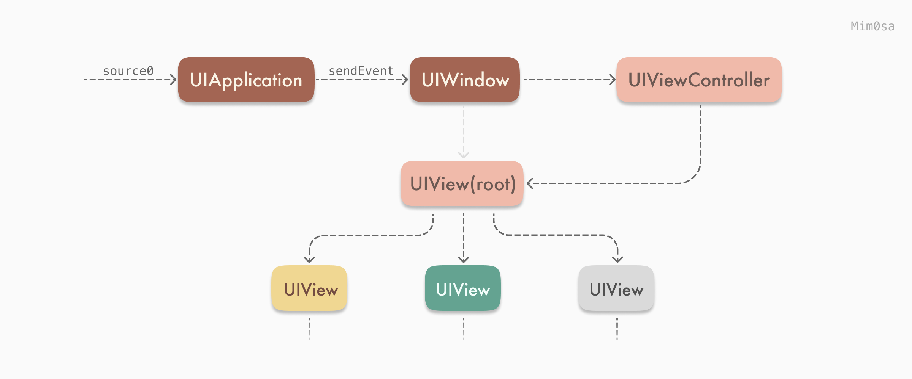
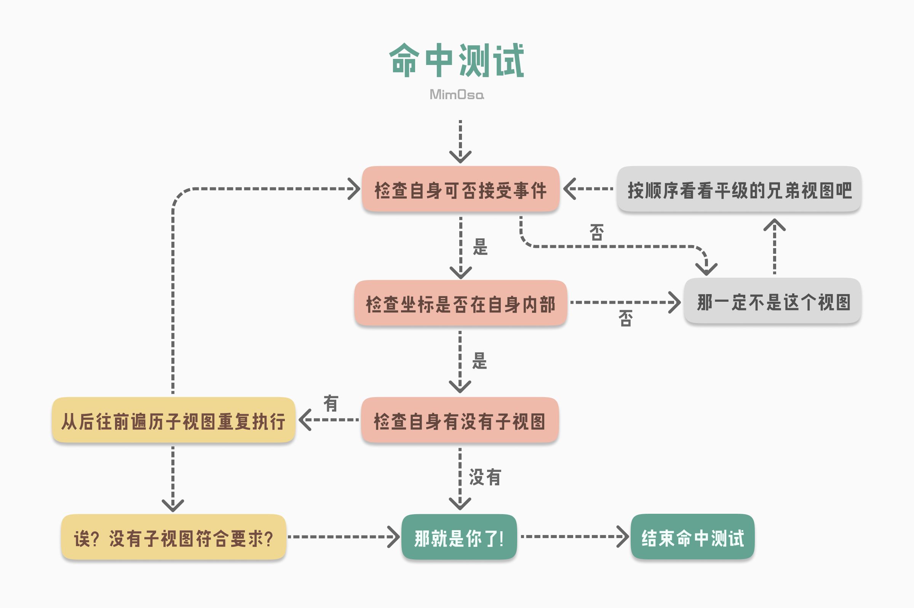
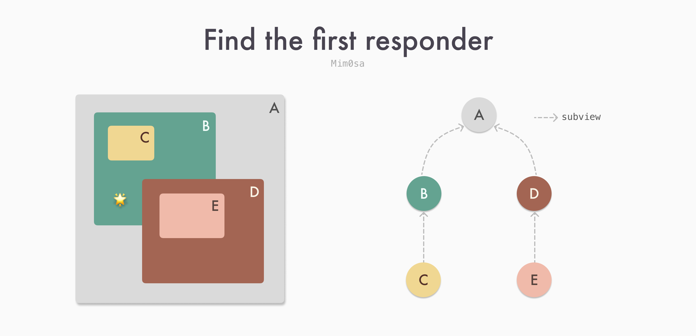
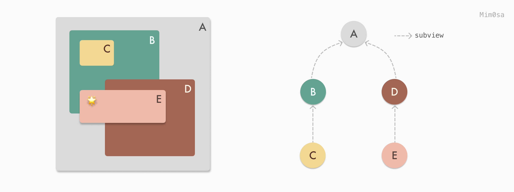
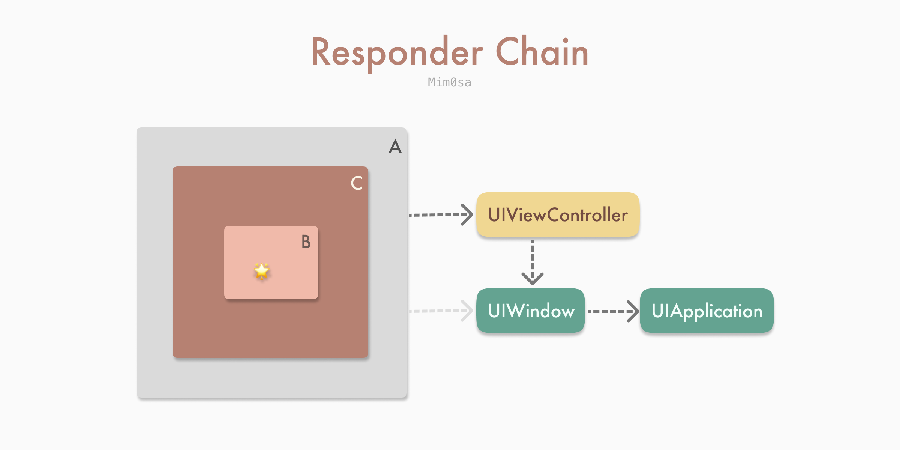
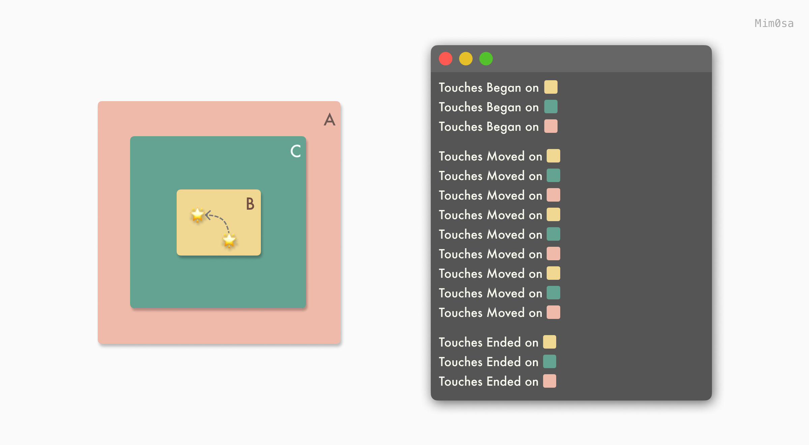
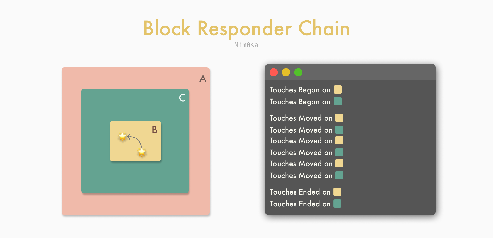

# iOS | 事件传递及响应链

试想一下假如你是一台手机📟，当有人触摸了屏幕之后，你需要找到他具体触摸了什么东西，他可能触摸是一个按钮，或一个列表，也有可能是一个一不小心的误触，你会设计一个怎么样的机制和系统来处理呢？假如有两个按钮重叠了，或者遇到在滚动列表上需要拖动某个按钮的情况，你设计的机制能正常的运作嘛？在 iOS 中系统通过 UIKit 已经为我们设计好了一套方案，也是本文浅谈的内容： iOS 中的事件传递及响应链机制。


<!--more-->


## 谁来响应事件

在 UIKit 中我们使用响应者对象（*Responder*）接收和处理事件。一个响应者对象一般是 `UIResponder` 类的实例，它常见的子类包括 `UIView`，`UIViewController` 和 `UIApplication`，这意味着几乎所有我们日常使用的控件都是响应者，如 `UIButton`，`UILabel` 等等。


在 `UIResponder` 及其子类中，我们是通过有关触摸（*UITouch*）的方法来处理和传递事件（*UIEvent*），具体的方法如下：

```swift
open func touchesBegan(_ touches: Set<UITouch>, with event: UIEvent?)
open func touchesMoved(_ touches: Set<UITouch>, with event: UIEvent?)
open func touchesEnded(_ touches: Set<UITouch>, with event: UIEvent?)
open func touchesCancelled(_ touches: Set<UITouch>, with event: UIEvent?)
```

>  `UIResponder` 还可以处理 `UIPress`、加速计、远程控制事件，这里仅讨论触摸事件。

在 `UITouch` 内，存储了大量触摸相关的数据，当手指在屏幕上移动时，所对应的 `UITouch` 数据也会更新，例如：这个触摸是在哪个 window 或者哪个 view 内发生的？当前触摸点的坐标是？前一个触摸点的坐标是？当前触摸事件的状态是？这些都存储在 `UITouch` 里面。另外需要注意的是，在这四个方法的参数中，传递的是 `UITouch` 类型的一个集合（而不是一个 `UITouch`），这对应了两根及以上手指触摸同一个视图的情况。


## 确定第一响应者

当有人用触摸了屏幕之后，我们需要找到使用者到底触摸了一个什么东西，或者可以理解为我们要找到，在这次使用者触摸之后，使用者最想要哪个控件发起响应。这个过程就是确定这次触摸事件的第一响应者是谁。

在触摸发生后，`UIApplication` 会触发 `func sendEvent(_ event: UIEvent)` 将一个封装好的 `UIEvent` 传给 `UIWindow`，也就是当前展示的 `UIWindow`，通常情况接下来会传给当前展示的 `UIViewController`，接下来传给 `UIViewController` 的根视图。这个过程是一条龙服务，没有分叉。但是在传递给当前 `UIViewController` 的根视图之后，就是开发人员的主战场，视图的层级结构就可以变得错综复杂起来了。

> 这里我们使用 `UIView` 来作为视图层级的主要组成元素，便于理解。但不止 `UIView` 可以响应事件，实际只要是 `UIResponder` 的子类，都可以响应和传递事件。后文会大量用 `视图` 或 `UIView` 来举例，实则代指一个合格的响应者。



回到开头的问题，我现在变成了一台手机📱，并且我知道有人触摸了屏幕。我所拥有的信息是触摸点的坐标，我知道应该就是视图层级中其中的某一个，但我无法直接知道用户是想点哪个视图。我需要一个策略来找到这个第一响应者，UIKit 为我们提供了命中测试（*hit-testing*）来确定触摸事件的响应者，这个策略具体是这样运作的：

### 命中测试



关于图中还有一些细节需要先说明：

* 在 `检查自身可否接收事件` 中，如果视图符合以下三个条件中的任一个，都会无法接收事件：
  1. `view.isUserInteractionEnabled = false` 
  2. `view.alpha <= 0.01` 
  3. `view.isHidden = true` 
* `检查坐标是否在自身内部` 这个过程使用了 `func point(inside point: CGPoint, with event: UIEvent?) -> Bool` 方法来判断坐标是否在自身内部，该方法是可以被重写的。
* `从后往前遍历子视图重复执行` 指的是按照 `FILO` 的原则，将其所有子视图按照「后添加的先遍历」的规则进行命中测试。该规则保证了系统会优先测试视图层级树中最后添加的视图，如果视图之间有重叠，该视图也是同级视图中展示最完整的视图，即用户最可能想要点的那个视图。
* 在 `按顺序看看平级的兄弟视图` 时，若发现已经没有未检查过的视图了，则应走向 `诶？没有子视图符合要求？`。

下面我们举个例子来解释这个流程，在例子中我们从当前 `UIViewController` 的根视图开始执行这个流程。下图中灰色视图 A 可以看作是当前 `UIViewController` 的根视图，右侧表示了各个视图的层级结构，用户在屏幕上的触摸点是🌟处，并且这 5 个视图都可以正常的接收事件。⚠️并且注意，D 比 B 更晚添加到 A 上。



具体的流程如下：

* 首先对 A 进行命中测试，显然🌟是在 A 内部的，按照流程接下来检查 A 是否有子视图。
* 我们发现 A 有两个子视图，那我们就需要按 `FILO` 原则遍历子视图，先对 D 进行命中测试，后对 B 进行命中测试。
* 我们对 D 进行命中测试，我们发现🌟不在 D 的内部，那就说明 D 及其子视图一定不是第一响应者。
* 按顺序接下来对 B 进行命中测试，我们发现🌟在 B 的内部，按照流程接下来检查 B 是否有子视图。
* 我们发现 B 有一个子视图 C，所以需要对 C 进行命中测试。
* 显然🌟不在 C 的内部，这时我们得到的信息是：触摸点在 B 的内部，但不在 B 的任一子视图内。
* 得到结论：B 是第一响应者，并且结束命中测试。
* 整个命中测试的走向是这样的：A✅ --> D❎ --> B✅ --> C❎ >>>> ***B***

整个流程应该算是清晰明了🐶，实际上这个流程就是 `UIView` 的一个方法：`func hitTest(_ point: CGPoint, with event: UIEvent?) -> UIView?`，方法最后返回的 `UIView?` 即第一响应者，这个方法代码还原应该是这样的：

```swift
class HitTestExampleView: UIView {
    override func hitTest(_ point: CGPoint, with event: UIEvent?) -> UIView? {
        if !isUserInteractionEnabled || isHidden || alpha <= 0.01 {
            return nil // 此处指视图无法接受事件
        }
        if self.point(inside: point, with: event) { // 判断触摸点是否在自身内部
            for subview in subviews.reversed() { // 按 FILO 遍历子视图
                let convertedPoint = subview.convert(point, from: self)
                let resultView = subview.hitTest(convertedPoint, with: event) 
                // ⬆️这句是判断触摸点是否在子视图内部，在就返回视图，不在就返回nil
                if resultView != nil { return resultView }
            }
            return self // 此处指该视图的所有子视图都不符合要求，而触摸点又在该视图自身内部
        }
        return nil // 此处指触摸点是否不在该视图内部
    }
}
```

### 小心越界！

针对这个流程举个额外的例子，如果按下图的视图层级和触摸点来判断的话，最终获得第一响应者仍然是 B，甚至整个命中测试的走向和之前是一样的：A✅ --> D❎ --> B✅ --> C❎ >>>> ***B***，究其原因是在 D 检查触摸点是否在自身内部时，答案是否，所以不会去对 E 进行命中测试，即使看起来我们点了 E。这个例子告诉我们，要注意可点击的子视图是否会超出父视图的范围。另若有这种情况可以重写 `func point(inside point: CGPoint, with event: UIEvent?) -> Bool` 方法来扩大点击有效范围。对于这种处理方式，个人觉得是可以，但没必要，寻求合理的视图布局和清晰易读的代码比这个关键💪。




## 通过响应链传递事件

### 确定响应链成员

在找到了第一响应者之后，整个响应链也随着确定下来了。所谓响应链是由响应者组成的一个链表，链表的头是第一响应者，链表的每个结点的下一个结点都是该结点的 `next` 属性。

> 其实响应链就是在命中测试中，走通的路径。用上个章节的例子，整个命中测试的走向是：A✅ --> D❎ --> B✅ --> C❎，我们把没走通的❎的去掉，以第一响应者 B 作为头，依次连接，响应链就是：B -> A。（实际上 A 后面还有控制器等，但在该例子中没有展示控制器等，所以就写到 A）

默认来说，若该结点是 `UIView` 类型的话，这个 `next` 属性是该结点的父视图。但也有几个例外：

- 如果是 `UIViewController` 的根视图，则下一个响应者是 `UIViewController`。
- 如果是 `UIViewController`
  - 如果 `UIViewController` 的视图是 `UIWindow` 的根视图，则下一个响应者是 `UIWindow` 对象。
  - 如果 `UIViewController` 是由另一个 `UIViewController` 呈现的，则下一个响应者是第二个 `UIViewController`。
- `UIWindow`的下一个响应者是 `UIApplication`。
- `UIApplication` 的下一个响应者是 `app delegate`。但仅当该 `app delegate` 是 `UIResponder` 的实例且不是 `UIView`、`UIViewController` 或 app 对象本身时，才是下一个响应者。

下面举个例子来说明。如下图所示，触摸点是🌟，那根据命中测试，B 就成为了第一响应者。由于 C 是 B 的父视图、A 是 C 的父视图、同时 A 是 Controller 的根视图，那么按照规则，响应链就是这样的：

`视图 B` -> `视图 C` -> `根视图 A` -> `UIViewController 对象` -> `UIWindow 对象` -> `UIApplication 对象` -> `App Delegate`



> 图中浅灰色的箭头是指将 `UIView` 直接添加到 `UIWindow` 上情况。

### 沿响应链传递事件

触摸事件首先将会由第一响应者响应，触发其 `open func touchesBegan(_ touches: Set<UITouch>, with event: UIEvent?)` 等方法，根据触摸的方式不同（如拖动，双指），具体的方法和过程也不一样。若第一响应者在这个方法中不处理这个事件，则会传递给响应链中的下一个响应者触发该方法处理，若下一个也不处理，则以此类推传递下去。若到最后还没有人响应，则会被丢弃（比如一个误触）。 我们可以创建一个 `UIView` 的子类，并加入一些打印函数，来观察响应链具体的工作流程。

```swift
class TouchesExampleView: UIView {
    override func touchesBegan(_ touches: Set<UITouch>, with event: UIEvent?) {
        print("Touches Began on " + colorBlock)
        super.touchesBegan(touches, with: event)
    }
    
    override func touchesMoved(_ touches: Set<UITouch>, with event: UIEvent?) {
        print("Touches Moved on " + colorBlock)
        super.touchesMoved(touches, with: event)
    }
  
    override func touchesEnded(_ touches: Set<UITouch>, with event: UIEvent?) {
        print("Touches Ended on " + colorBlock)
        super.touchesEnded(touches, with: event)
    }
}
```

下面我们举一个例子。如下图，A B C 都是 `UIView`，我们将手指按照🌟的位置和箭头的方向在屏幕上移动一段距离，然后松开手。我们应该能在控制台看到下右图的输出。我们可以看到，A B C 三个视图都积极的响应了每一次事件，每次触摸的发生后，都会先触发 B 的响应方法，然后传递给 C，在传递给 A。但是这种「积极」的响应其实意味着在我们这个例子中，A B C 都不是这个触摸事件的合适接受者。他们之所以「积极」的将事件传递下去，是因为他们查看了这个事件的信息之后，认为自己并不是这个事件的合适处理者。（当然了，我们这边放的是三个 `UIView`，他们本身确实也不应该能处理事件）



那么如果我们把上图中的 C 换成平时使用的 `UIControl` 类，控制台又会怎么打印呢？如右下图所示，会发现响应链的事件传递到 C 处就停止了，也就是 A 的 touches 方法没有被触发。这意味着在响应链中，`UIControl` 及其子类默认来说，是不会将事件传递下去的。在代码中，可以理解为 `UIView` 默认会在其 touches 方法中去调用其 `next` 的 touches 方法，而 `UIControl` 默认不会去调用。这样就做到了，当某个控件接受了事件之后，事件的传递就会终止。另外，`UIScrollView` 也是这样的工作机制。



>  `UIControl` 接收信息的机制是 `target-action` 机制，和 `UIGestureRecognizer` 的处理方式完全不一样，在下篇响应链x手势的文章中会谈到区别。

当然，我们其实可以继承 `UIView`，来制作一个既处理事件，又继续传递事件的 `View`。又或是继承 `UIControl`，在合适的时机触发 `next` 的对应 touches 方法，也能做到相同效果。只是做之前要想清楚⚠️🍄，你是不是真的要把一个事件发放给多个控件来处理？当控件的层级关系重新排列时，效果还是否正确？你是不是单纯想搞事？等问题。


## 总结

总的来说，触摸屏幕后事件的传递可以分为以下几个步骤：

1. 通过命中测试来找到「第一响应者」
2. 由「第一响应者」来确定「响应链」
3. 将事件沿「响应链」传递
4. 事件被某个响应者接收，或没有响应者接收从而被丢弃

这些步骤都是建立在不使用 `UIGestureRecognizer ` 的基础上的，下一篇文章会谈一下响应链x手势的情况。