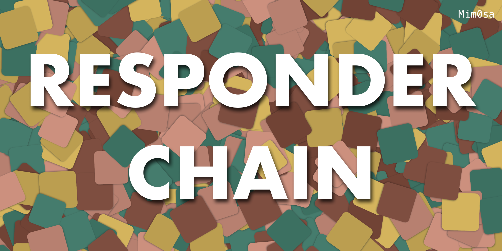

# iOS | 事件传递及响应链

试想一下假如你是一台手机📟，当有人触摸了屏幕之后，你需要找到他具体触摸了什么东西？他可能触摸是一个按钮，或一个列表，也有可能是一个一不小心的误触，你会设计一个怎么样的机制和系统来处理呢？假如有两个按钮重叠了，或者遇到在滚动列表上需要拖动某个按钮的情况，你设计的机制能正常的运作嘛？在 iOS 中系统通过 UIKit 已经为我们设计好了一套方案，也就是本文浅谈的内容： iOS 中的事件传递及响应链机制。

<!--more-->

## 谁来响应事件

iOS 使用响应者对象接收和处理事件。一个响应者对象可以是 `UIResponder` 类的任何实例，常见的子类包括 `UIView`，`UIViewController` 和 `UIApplication`。这意味着几乎所有我们日常使用的控件都是一个响应者。

## 确定第一响应者

## 通过响应者链传递事件

## 手势的优先级

