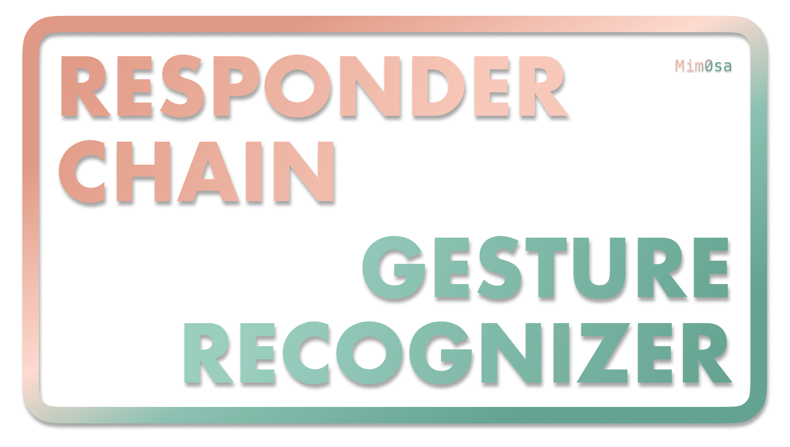

# iOS | 响应链及手势识别

在上一篇「[事件传递及响应链](https://mim0sa.github.io/2020/11/05/事件传递及响应链.html)」中介绍了当屏幕上发生一次触摸之后，系统会如何寻找「第一响应者」，在寻找到「第一响应者」之后，如何确定「响应链」以及如何沿「响应链」传递事件。在上一篇文章的环境中，是不使用 `UIGestureRecognizer` 的。但是在我们平时的开发中，使用 `UIGestureRecognizer` 及其子类比继承一个 `UIView` 的类、重写 touches 方法要方便的很多。但是这两种方法对事件的处理机制有所不同，这也是本文的讨论内容：响应链及手势识别在处理事件时的异同。

<!--more-->

## 通过 Touches 系列方法阻断响应链

首先先回顾一下事件传递及响应链的大致流程：

1. 通过命中测试来找到「第一响应者」
2. 由「第一响应者」来确定「响应链」
3. 将事件沿「响应链」传递
4. 事件被某个响应者接收，或没有响应者接收从而被丢弃

在步骤 3 中，事件沿「响应链」传递这个过程，就是响应者通过调用其 `next` 的 touches 系列方法来实现的。在上篇文章中我们也提到，假如我们使用 `UIControl` 等类作为响应者，这些类本身就不会调用其 `next` 的 touches 系列方法，从而实现阻断响应链的效果，或者说实现接受某个事件的效果。

那么下面通过一个稍复杂一点的例子来探究一下 touches 系列方法阻断响应链的一些细节。

