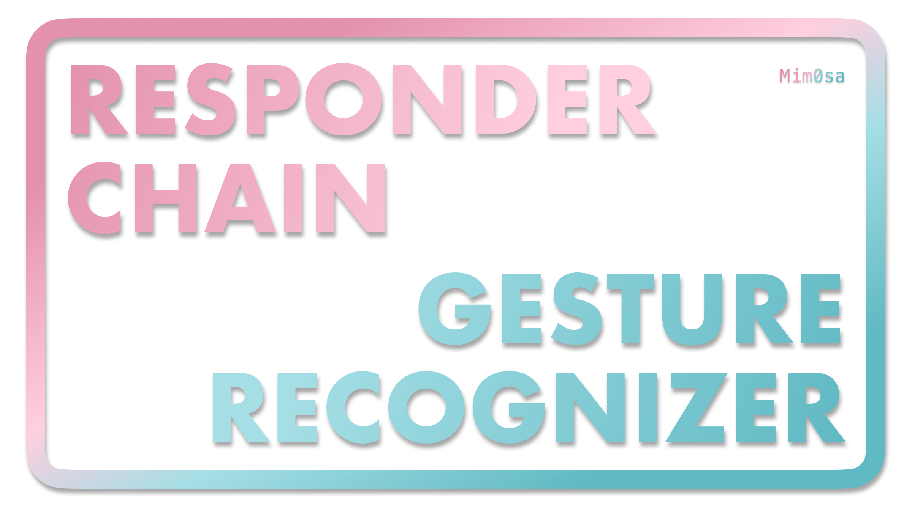
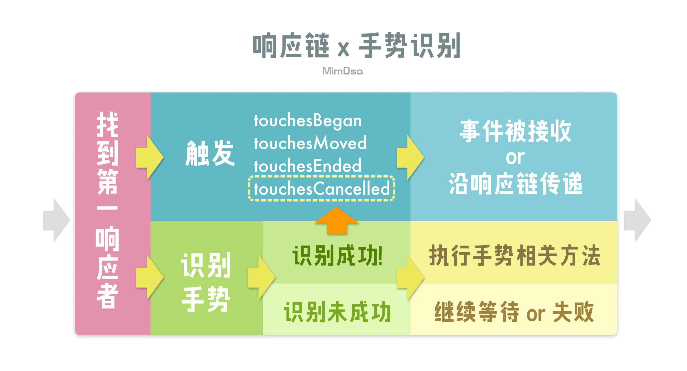

# iOS | 响应链及手势识别

在上一篇「[事件传递及响应链](https://mim0sa.github.io/2020/11/05/事件传递及响应链.html)」中介绍了当屏幕上发生一次触摸之后，系统会如何寻找「第一响应者」，在寻找到「第一响应者」之后，如何确定「响应链」以及如何沿「响应链」传递事件。在上一篇文章的环境中，是不使用 `UIGestureRecognizer` 的。但是在我们平时的开发中想要给一个 `UIView` 加上处理事件的能力的话，使用 `UIGestureRecognizer` 及其子类比继承一个 `UIView` 的类、重写 touches 方法要方便的很多。这两种方法对事件的处理机制相互影响又有所不同。这也是本文的讨论内容：通过响应链及手势识别处理事件。



<!--more-->

首先我们先回顾一下事件传递及响应链的大致流程：

1. 通过「命中测试」来找到「第一响应者」
2. 由「第一响应者」来确定「响应链」
3. 将事件沿「响应链」传递
4. 事件被某个响应者接收，或没有响应者接收从而被丢弃

在步骤 3 中，事件沿「响应链」传递这个过程，就是响应者通过调用其 `next` 的 touches 系列方法来实现的。在上篇文章中我们也提到，假如我们使用 `UIControl` 等类作为响应者，这些类本身就不会调用其 `next` 的 touches 系列方法，从而实现阻断响应链的效果，也可以认为是实现接受某个事件的效果。那在这篇文章中，我们将浅析在有  `UIGestureRecognizer` 参与的情况下，事件的处理和接收是如何运作的。


## 当手势识别参与响应链

上篇文章中，我们只讨论了下图中蓝色部分事件沿响应链传递的流程，但实际上，同时一起发生的还有图中下半部分手势识别的部分。



从图中我们可以看到，在通过命中测试找到第一响应者之后，会将 `UITouch` 分发给 `UIResponder` 的 touches 系列方法（具体方法见上篇文章），同时也会分发给手势识别系统，让这两个处理系统同时工作。

首先要注意的是，上图中蓝色部分的流程并不会只执行一次，举例来说：当我们用一根手指在一个视图上缓慢滑动时，会产生一个 `UITouch` 对象，这个 `UITouch` 对象会随着你手指的滑动，不断的更新自身，同时也不断地触发 touches 系列方法。一般来说，我们会得到如下类似的触发顺序：

```
touchesBegan     // 手指触摸屏幕
touchesMoved     // 手指在屏幕上移动
touchesMoved     // ...
...
touchesMoved     // ...
touchesMoved     // 手指在屏幕上移动
touchesEnded     // 手指离开屏幕
```

`UITouch` 的 `gestureRecognizers` 属性中的存储了在寻找第一响应者的过程中收集到的手势，而在不断触发 touches 系列方法的过程中，手势识别系统也在在不停的判断当前这个 `UITouch` 是否符合收集到的某个手势。

**当手势识别成功：**被触摸的那个视图，也就是第一响应者会收到 touchesCancelled 的消息，并且该视图不会再收到来自该 `UITouch` 的 touches 事件。同时也让该 `UITouch` 关联的其他手势也收到 touchesCancelled，并且之后不再收到此 `UITouch` 的 touches 事件。这样做就实现了该识别到的手势能够独占该 `UITouch`。具体表现参考如下：

```
touchesBegan     // 手指触摸屏幕
touchesMoved     // 手指在屏幕上移动
touchesMoved     // ...
...
touchesMoved     // ...
touchesMoved     // 手指在屏幕上移动
touchesCancelled // 手势识别成功，touches 系列方法被阻断
// 现在手指💅并没有离开屏幕
// 但如果继续滑动🛹的话
// 并不会触发 touches 系列方法
```

**当手势识别未成功：**指暂时未识别出来，不代表以后不会识别成功，不会阻断响应链。注意这里指的是未成功，并不一定是失败。在手势的内部状态中，手势大部分情况下状态是 `.possible`，指的是 `UITouch` 与其不匹配，但之后可能有机会识别成功。而 `.fail` 是真的识别失败，指的是以目前的触摸情况来看已经不可能是这个手势了，并且在下个 runloop 会从 `gestureRecognizers` 中移除该手势。


